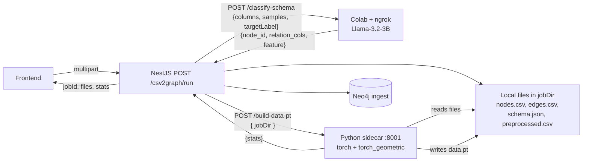

# Back-end KLTN — Fraud Detection Graph Platform

Back-end NestJS đóng vai trò **Orchestrator** cho nền tảng phát hiện gian lận trên đồ thị. Hệ thống có **3 luồng nghiệp vụ**:

| Luồng | Tên | Trạng thái | Module |
| --- | --- | --- | --- |
| **A** | CSV → Graph (data pipeline + build data.pt) | ✅ Đã xong | `src/csv2graph/` |
| **B** | GNN Fraud Scoring | 🚧 **Chưa implement** | (chưa có) |
| **C** | Text2Cypher (NL query) | ✅ Đã xong | `src/text2cypher/` + `src/graph/` |

NestJS không tự suy luận AI. Mọi suy luận được delegate ra ngoài (Colab + ngrok cho LLM, Python sidecar local cho PyTorch). NestJS điều phối: nhận request FE → forward đúng AI service → persist Neo4j → format kết quả → trả FE.

---

## 1. Kiến trúc tổng quan

```
                   ┌────── [Colab + ngrok]      Llama-3.2-3B (CSV2Graph /classify-schema)
                   │
                   ├────── [Colab + ngrok]      Qwen2 + LoRA (Text2Cypher /generate + /correct)
                   │
[React FE] ── HTTP ─▶ [NestJS Orchestrator :3000]
                   │
                   ├────── [Python sidecar 127.0.0.1:8001]   csvtograph_sidecar.py — build data.pt
                   │
                   └────── [Neo4j local]        bolt://localhost:7687
```

**Phân vai:**

| Thành phần | Vai trò |
| --- | --- |
| React FE | Giao diện, không gọi AI service trực tiếp. |
| NestJS BE `:3000` | Orchestrator: file I/O, gọi LLM/sidecar, ingest Neo4j, chuẩn hoá response. |
| Colab CSV2Graph | Llama-3.2-3B classify-schema. JSON only (không truyền file). |
| Colab Text2Cypher | Qwen2 + LoRA. `/generate` + `/correct` — JSON only. |
| Python sidecar `:8001` | `csvtograph_sidecar.py` — đọc CSV local + build PyG `data.pt`. Bind loopback. |
| Neo4j local | Lưu graph. NestJS là client duy nhất. |

**Tại sao tách:**
- Colab: cần GPU cho LLM, dùng ngrok tunnel; truyền JSON (vài KB) thay vì file.
- Python sidecar local: PyTorch + PyG cần cài Python, không nhúng vào NestJS; bind `127.0.0.1` đủ an toàn.

---

## 2. Yêu cầu môi trường

- Node.js 18+
- Neo4j 5+ chạy local (mặc định `bolt://localhost:7687`). Khuyến nghị plugin **APOC** (cho `apoc.create.relationship` dynamic relationship type).
- Python 3.10+ với `csvtograph_sidecar.py` chạy local (cần `torch`, `torch-geometric`, `pandas`, `scikit-learn`, `fastapi`, `uvicorn`).
- (CSV2Graph) Colab notebook chạy `python-services/colab/csv2graph_colab.py` qua ngrok.
- (Text2Cypher) Colab notebook chạy Qwen2 Text2Cypher qua ngrok.

---

## 3. Cài đặt & chạy

```bash
# Cài deps NestJS
npm install
cp .env.example .env

# Chạy NestJS (dev — watch mode)
npm run dev

# Chạy Python sidecar (terminal khác)
cd python-services
uvicorn csvtograph_sidecar:app --host 127.0.0.1 --port 8001
```

NestJS mặc định `http://localhost:3000`.

---

## 4. Biến môi trường

| Biến | Ý nghĩa | Mặc định |
| --- | --- | --- |
| `PORT` | Port NestJS | `3000` |
| `AI_PROVIDER` | Text2Cypher backend (`mock` \| `ngrok`) — hiện chỉ dùng `ngrok` | `mock` |
| `TEXT2CYPHER_URL` | URL ngrok Colab Text2Cypher (có `/generate` + `/correct`) | — |
| `AI_TIMEOUT_MS` | Timeout call Colab Text2Cypher | `180000` |
| `CSV2GRAPH_LLM_URL` | URL ngrok Colab CSV2Graph (có `/classify-schema`) | — |
| `CSV2GRAPH_TIMEOUT_MS` | Timeout call Colab `/classify-schema` | `300000` |
| `CSV2GRAPH_SIDECAR_URL` | URL Python sidecar local (build `data.pt`) | `http://127.0.0.1:8001` |
| `CSV2GRAPH_SIDECAR_TIMEOUT_MS` | Timeout call sidecar `/build-data-pt` | `600000` |
| `CSV2GRAPH_OUTPUT_DIR` | Folder lưu output theo jobId (relative `process.cwd()`) | `data/csv2graph` |
| `CSV2GRAPH_MAX_GROUP_SIZE` | Cap số node mỗi relation group | `500` |
| `CSV2GRAPH_NODE_BATCH_SIZE` | Batch size UNWIND nodes vào Neo4j | `5000` |
| `CSV2GRAPH_EDGE_BATCH_SIZE` | Batch size UNWIND edges vào Neo4j | `10000` |
| `CSV2GRAPH_USE_APOC` | `auto` \| `true` \| `false` (auto = detect runtime) | `auto` |

---

## 5. API Contract (cho Front-End)

Tất cả response đều có shape chuẩn:

```json
// Success (200)
{ "status": "success", "...": "data" }

// Error (4xx/5xx)
{ "status": "error", "message": "...", "statusCode": 502 }
```

Global filter `AllExceptionsFilter` chuẩn hoá mọi lỗi.

### 5.1. Neo4j connection

#### `POST /neo4j/connect`

Kết nối driver Neo4j. Phải gọi trước mọi endpoint dùng Neo4j.

```json
// Request
{
  "uri": "bolt://localhost:7687",
  "user": "neo4j",
  "password": "12345678",
  "dbId": "fraud_db"
}

// Response
{ "status": "success", "message": "Đã kết nối tới bolt://localhost:7687 (dbId: fraud_db)" }
```

`dbId` (optional): khi set, schema sẽ được cache tại `data/schemas/schema_<dbId>.txt` để Text2Cypher dùng lại lần sau (không cần query Neo4j lại).

#### `POST /neo4j/disconnect`

Đóng driver. Không body.

```json
{ "status": "success", "message": "Đã ngắt kết nối" }
```

#### `GET /neo4j/status`

```json
{ "status": "success", "connected": true, "uri": "bolt://localhost:7687" }
```

---

### 5.2. CSV2Graph (Luồng A) — `POST /csv2graph/run`

`multipart/form-data`. Một-shot endpoint: upload CSV → trả tất cả kết quả.

**Request fields:**

| Field | Loại | Bắt buộc | Mặc định |
| --- | --- | --- | --- |
| `file` | CSV file | có | — |
| `targetLabel` | string (tên cột nhãn) | có | — |
| `maxGroupSize` | int (≥2) | không | env hoặc `500` |
| `trainRatio` | float (0.01..0.99) | không | `0.4` |
| `valRatio` | float (0.01..0.99) | không | `0.2` |
| `seed` | int | không | `42` |
| `nodeLabel` | string (label Neo4j) | không | `Transaction` |
| `ingestNeo4j` | bool | không | `true` |

**Response:**

```json
{
  "status": "success",
  "jobId": "2026-05-07T15-42-38-723Z_mock_transactions_483a905a",
  "schema": {
    "node_id": "node_id",
    "relation_cols": ["cc_num", "merchant"],
    "feature_cols": ["amt", "category", "..."],
    "encoded_feature_cols": ["amt", "category_grocery_pos", "category_gas_transport", "..."],
    "target_label": "is_fraud",
    "train_ratio": 0.4, "val_ratio": 0.2, "seed": 42, "max_group_size": 500
  },
  "stats": {
    "inputRows": 12345,
    "numNodes": 12345,
    "numEdges": 24690,
    "numFeatures": 12,
    "numEncodedFeatures": 47,
    "numRelationTypes": 2,
    "ingested": { "nodes": 12345, "relationships": 24690 }
  },
  "files": {
    "inputCsv": "...input.csv",
    "nodesCsv": "...nodes.csv",
    "edgesCsv": "...edges.csv",
    "schemaJson": "...schema.json",
    "preprocessedCsv": "...preprocessed.csv",
    "dataPt": "...data.pt"
  }
}
```

`numFeatures` = số raw cols (= cột feature trong `nodes.csv`). `numEncodedFeatures` = chiều của tensor `x` trong `data.pt` (sau one-hot).

**Errors:**
- `400` — thiếu `file`, file rỗng, `targetLabel` không có trong header CSV.
- `502` — Colab `/classify-schema` lỗi / sidecar `/build-data-pt` lỗi.
- `504` — quá timeout (Colab/sidecar không phản hồi).
- `500` — file system / Neo4j ingest lỗi.

Chi tiết kiến trúc xem mục [§6](#6-csv2graph-chi-tiết).

---

### 5.3. Text2Cypher (Luồng C) — `POST /graph/query`

Truy vấn graph bằng câu hỏi tiếng Việt. NestJS làm Schema Linking (gọi `/generate` 2 lần — full schema + linked schema) → Self-Correction Loop (`EXPLAIN` + `/correct` retry tối đa 3 lần) → Execute Cypher trên Neo4j.

```json
// Request
{ "prompt": "liệt kê các giao dịch chung card với giao dịch fraud" }
```

**Response (success):**

```json
{
  "status": "success",
  "generatedCypher": "MATCH (t:Transaction)-[:HAS_CARD]->(c:Card)<-[:HAS_CARD]-(other:Transaction) WHERE other.is_fraud = true RETURN t, c, other",
  "graphData": {
    "nodes": [ { "id": "...", "label": "Transaction", "properties": { "...": "..." } } ],
    "links": [ { "source": "...", "target": "...", "type": "HAS_CARD" } ]
  },
  "scalars": [],
  "metadata": {
    "retries": 0,
    "cypherV1": "MATCH (t:Transaction)...",
    "cypherV2": "MATCH (t:Transaction)-[:HAS_CARD]->..."
  }
}
```

- `metadata.retries` — số lần self-correction loop chạy (0 = `EXPLAIN` pass ngay).
- `metadata.cypherV1` — Cypher từ `/generate` lần 1 (full schema).
- `metadata.cypherV2` — Cypher từ `/generate` lần 2 (linked schema, đã filter).

**Response (failure khi self-correction không sửa được):** HTTP `400`.

```json
{
  "status": "error",
  "message": "Không thể tạo Cypher query hợp lệ sau khi tự sửa",
  "statusCode": 400
}
```

**Errors:**
- `400` — prompt trống / Cypher generation thất bại / Cypher execute lỗi.
- `500` — `TEXT2CYPHER_URL` chưa cấu hình.
- `502` — Colab Text2Cypher lỗi.
- Connect Neo4j trước; nếu chưa connect, mọi query lookup schema sẽ fail.

---

### 5.4. GNN Fraud Scoring (Luồng B) — chưa implement

Sẽ thêm sau. Khi xong sẽ có endpoint dạng `POST /fraud/score` đọc `data.pt` (hoặc graph từ Neo4j) → chạy GNN inference → ghi `fraud_score` + `is_fraud` lên `:Transaction` trong Neo4j.

---

## 6. CSV2Graph chi tiết

### 6.1. Pipeline



8 bước trong [`csv2graph.service.ts`](src/csv2graph/csv2graph.service.ts):

1. Parse CSV (`csv-parse`) + filter cột ẩn `V1..Vn`.
2. `SchemaLlmService` → Colab `/classify-schema` (Llama-3.2-3B).
3. Enforce rules + add hidden features (`V1..Vn` quay lại làm feature ẩn).
4. `FeatureService.ensureNodeId` (raw rows) + `preprocessFeatures` (clone + one-hot + cast float → encoded rows).
5. `StarGraphService.buildStarEdges` từ raw rows (cap `maxGroupSize`).
6. `CsvOutputService` ghi `nodes.csv` (RAW), `edges.csv`, `schema.json` (chứa cả `feature_cols` raw + `encoded_feature_cols`).
7. (optional) `Neo4jIngestService` → UNWIND batch ingest từ raw rows.
8. `writePreprocessedCsv` (encoded) → `DataPtService` → sidecar `/build-data-pt` → sidecar đọc lại `edges.csv` để đảm bảo `data.pt` cùng cấu trúc graph với CSV → trả stats về NestJS.

### 6.2. Raw vs Encoded — phân biệt rõ

| File / Sink | Dữ liệu | Lý do |
| --- | --- | --- |
| `nodes.csv` | RAW (vd `category="grocery_pos"`) | Người đọc, debug, import vào tool khác |
| `edges.csv` | RAW `node_id` + `relation_type` | Cấu trúc graph, đọc-được |
| Neo4j ingest | RAW property values | Cypher `WHERE n.category = 'grocery_pos'` tự nhiên |
| `preprocessed.csv` | ENCODED (one-hot, float) | Input cho sidecar build `data.pt` |
| `data.pt` (`x`) | ENCODED + `StandardScaler` | Tensor input cho GNN |
| `data.pt` (`edge_index`) | Map từ chính `edges.csv` | Cùng cấu trúc graph với CSV |

### 6.3. Mô hình đồ thị

Mỗi dòng CSV = 1 node `:Transaction` (hoặc label tuỳ `nodeLabel`). Các transaction liên kết **gián tiếp** qua hub theo từng `relation_col` (cùng card, cùng merchant…).

LLM Llama-3.2-3B phân loại tự động mỗi cột thành 1 trong 3 vai trò:

| Vai trò | Ý nghĩa | Sử dụng |
| --- | --- | --- |
| `node_id` | Khoá chính (unique per row), tối đa 1 cột. NestJS auto-generate nếu LLM không tìm được. | Primary key của transaction node |
| `relation_cols` | Cột tham chiếu — giá trị giống nhau ⇒ liên kết. | Build star edges (cap `maxGroupSize` để tránh group quá lớn) |
| `feature` | Cột đặc trưng (số / categorical / boolean) | Lưu property + dùng cho GNN |

Cột `targetLabel` luôn là cột nhãn nhị phân (vd `is_fraud`).

### 6.4. Colab side (Llama-3.2-3B)

File [`python-services/colab/csv2graph_colab.py`](../python-services/colab/csv2graph_colab.py) — copy 1 cell vào Colab:

- Load `unsloth/Llama-3.2-3B-Instruct-bnb-4bit`.
- Endpoint duy nhất: `POST /classify-schema` body `{ validColumns, sampleValues, targetLabel }` → `{ node_id, relation_cols, feature }`.
- `GET /health`.
- Expose qua ngrok port 8000 → copy URL vào `CSV2GRAPH_LLM_URL`.

### 6.5. Python sidecar (build data.pt)

File [`python-services/csvtograph_sidecar.py`](../python-services/csvtograph_sidecar.py) — chạy local cùng máy với NestJS:

- FastAPI bind `127.0.0.1:8001` (loopback only).
- `POST /build-data-pt` body `{ jobDir }` → đọc `<jobDir>/preprocessed.csv` + `<jobDir>/edges.csv` + `<jobDir>/schema.json`, build PyG `Data`:
  - `x` từ `encoded_feature_cols` trong `preprocessed.csv` (`StandardScaler`).
  - `y` từ `target_label`.
  - `edge_index` map từ `edges.csv` (KHÔNG rebuild edges → đảm bảo data.pt và CSV cùng cấu trúc graph).
  - `train_mask` / `val_mask` / `test_mask` qua `add_splits` (fallback non-stratified khi class quá ít).
- `torch.save` xuống `<jobDir>/data.pt`. Trả `{ success, dataPt, stats }`.

Sidecar reuse `_extract_features` + `_extract_labels` + `add_splits` từ [`csvtograph/graph_utils.py`](../python-services/csvtograph/graph_utils.py).

### 6.6. Lưu ý

- **Không truyền binary qua ngrok**: NestJS chỉ gửi `{validColumns, sampleValues, targetLabel}` (vài KB) sang Colab. CSV và `data.pt` chỉ tồn tại local.
- **Sidecar bind loopback**: không expose ra LAN/Internet.
- **One-hot encoding trong NestJS**: cardinality cao tốn RAM. Service log warning khi unique values >50.
- **APOC**: nếu Neo4j có APOC → `apoc.create.relationship` cho dynamic type `SAME_<COL>`. Không có APOC → fallback `SAME_RELATION` + property `type`. Toggle qua `CSV2GRAPH_USE_APOC`.
- **CSV write synchronous** (`fs.writeFileSync`) thay vì stream để tránh race condition khi sidecar đọc file ngay sau đó.

---

## 7. Text2Cypher chi tiết

### 7.1. Pipeline

```
POST /graph/query { prompt }
  │
  ├─ [Schema Linking]
  │   ├─ SchemaService.getFullSchema(dbId)            ← cache file .txt hoặc Neo4j
  │   ├─ Colab /generate LẦN 1 (full schema)          → cypherV1
  │   ├─ SchemaService.filterSchemaByQuery(cypherV1)  → linked schema
  │   └─ Colab /generate LẦN 2 (linked schema)        → cypherV2
  │
  ├─ [Self-Correction Loop] (max 3 retries)
  │   ├─ Neo4j EXPLAIN cypherV2
  │   ├─ Pass → finalCypher ✓
  │   └─ Fail → Colab /correct (error_log) → retry EXPLAIN
  │
  ├─ Execute finalCypher (Neo4j READ session)
  └─ Response { status, generatedCypher, graphData, scalars, metadata }
```

### 7.2. Schema cache

Lần đầu connect (có `dbId`): NestJS fetch schema + 3-5 sample examples mỗi node label từ Neo4j → lưu `data/schemas/schema_<dbId>.txt`. Các lần sau chỉ đọc file cache.

### 7.3. Colab endpoints

NestJS gọi 2 endpoint của Colab Text2Cypher (`TEXT2CYPHER_URL`):

| Endpoint | Body | Response |
| --- | --- | --- |
| `POST /generate` | `{ question, schema }` | `{ cypher }` |
| `POST /correct` | `{ question, schema, wrong_cypher, error_log }` | `{ cypher }` |

### 7.4. Ngrok tips

- URL ngrok đổi mỗi lần restart Colab → cập nhật `TEXT2CYPHER_URL` + restart NestJS.
- Free ngrok có cảnh báo trang HTML → NestJS gửi header `ngrok-skip-browser-warning: true` (đã handle trong `NgrokAiService`).
- Colab disconnect ~12h → keep-alive JS trong notebook.

---

## 8. Cấu trúc thư mục

```
src/
├── main.ts                    CORS + ValidationPipe + ExceptionFilter
├── app.module.ts              Wire tất cả module
├── common/
│   └── http-exception.filter.ts
├── neo4j/                     Connect/disconnect/status + EXPLAIN helper
│   ├── neo4j.module.ts
│   ├── neo4j.controller.ts
│   ├── neo4j.service.ts
│   └── dto/connect-neo4j.dto.ts
├── csv2graph/                 LUỒNG A — CSV → Graph (one-shot pipeline)
│   ├── csv2graph.module.ts
│   ├── csv2graph.controller.ts        POST /csv2graph/run
│   ├── csv2graph.service.ts           Orchestrator 8 steps
│   ├── schema-llm.service.ts          Colab /classify-schema
│   ├── feature.service.ts             ensureNodeId + preprocessFeatures (clone)
│   ├── star-graph.service.ts          buildStarEdges (cap maxGroupSize)
│   ├── csv-output.service.ts          writeNodesCsv/EdgesCsv/SchemaJson/PreprocessedCsv
│   ├── neo4j-ingest.service.ts        UNWIND batch ingest (APOC optional)
│   ├── data-pt.service.ts             Gọi sidecar /build-data-pt
│   ├── dto/csv2graph-run.dto.ts
│   ├── dto/csv2graph-result.dto.ts
│   └── interfaces/classification-schema.interface.ts
├── text2cypher/               LUỒNG C — Schema Linking + Self-Correction
│   ├── text2cypher.module.ts
│   ├── text2cypher.service.ts         generateCypher / generateWithSchemaLinking / selfCorrectionLoop
│   ├── schema.service.ts              getFullSchema + filterSchemaByQuery + cache .txt
│   └── dto/text2cypher-result.dto.ts
├── graph/                     Public endpoint cho Text2Cypher
│   ├── graph.module.ts
│   ├── graph.controller.ts            POST /graph/query → Text2CypherService → format
│   ├── graph.formatter.ts             Convert neo4j Records → { nodes, links, scalars }
│   └── dto/query.dto.ts
└── ai/                        Legacy AI client (dùng riêng cho NgrokAiService)
    ├── ai.interface.ts
    ├── ai.service.ts                   MockAiService (Plan B khi ngrok die)
    ├── ngrok-ai.service.ts             Gửi `ngrok-skip-browser-warning`
    └── ai.module.ts
```

`data/csv2graph/<jobId>/` — output mỗi lần chạy `/csv2graph/run` (đã gitignore).
`data/schemas/schema_<dbId>.txt` — cache schema cho Text2Cypher.

---

## 9. Test thủ công (Postman)

### Setup
1. `POST /neo4j/connect` `{ uri, user, password, dbId: "fraud_db" }` → `success`.
2. `GET /neo4j/status` → `connected: true`.

### CSV2Graph
3. `POST /csv2graph/run` (multipart): `file` = CSV mẫu, `targetLabel` = `is_fraud` → trả `jobId`, `schema`, `stats`, `files`.
4. Kiểm tra folder `data/csv2graph/<jobId>/`: phải có đủ `input.csv`, `nodes.csv` (raw), `edges.csv`, `schema.json`, `preprocessed.csv` (encoded), `data.pt`.
5. Mở Neo4j Browser → `MATCH (n) RETURN count(n)` → thấy nodes.

### Text2Cypher
6. `POST /graph/query` `{ "prompt": "liệt kê 10 giao dịch đầu tiên" }` → `generatedCypher` + `graphData`.
7. `POST /graph/query` body trống → `400`.
8. `POST /graph/query` khi chưa connect Neo4j → schema fetch fail.

### Teardown
9. `POST /neo4j/disconnect`.

---

## 10. Roadmap

- [x] Module Neo4j (connect/disconnect/status + dbId + EXPLAIN)
- [x] Module Text2Cypher (Schema Linking + Self-Correction Loop)
  - [x] `SchemaService` (fetch schema+examples, cache `.txt`, filter/linking)
  - [x] `Text2CypherService` (`generateCypher` + `generateWithSchemaLinking` + `selfCorrectionLoop`)
  - [x] Colab endpoints `/generate` + `/correct`
- [x] Module Graph (`POST /graph/query` → `Text2CypherService` → format)
- [x] Module CSV2Graph (luồng A)
  - [x] `POST /csv2graph/run` one-shot pipeline (multipart upload)
  - [x] Schema LLM (Colab Llama-3.2-3B `/classify-schema`)
  - [x] Feature engineering raw + encoded copy (no mutate)
  - [x] Star topology edges
  - [x] CSV outputs (raw nodes + edges + schema + encoded preprocessed)
  - [x] Neo4j UNWIND batch ingest (APOC + fallback)
  - [x] Python sidecar `csvtograph_sidecar.py` build `data.pt`
- [x] Global exception filter + CORS + DTO validation
- [ ] **Module Fraud Scoring (luồng B — GNN inference)** — chưa làm
- [ ] FE tích hợp đầy đủ 3 luồng
- [ ] Unit + E2E test
