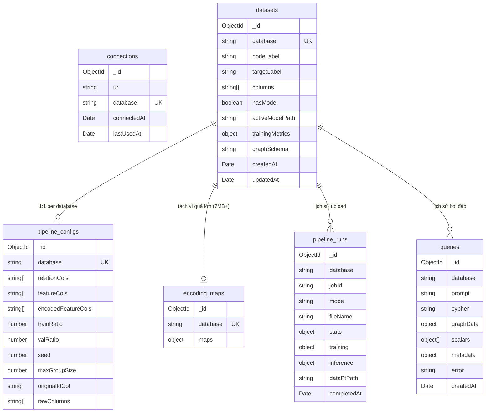

# Tích hợp MongoDB Atlas — Persistent Storage cho Fraud Detection Platform

## Bối cảnh & Mục tiêu

Hệ thống lưu trữ dữ liệu bằng **file hệ thống** (`.txt`, `.json`, `.csv`) và **localStorage** ở browser. Điều này gây mất data khi clear browser, không persistent qua các phiên làm việc, và file CSV trung gian chiếm nhiều dung lượng.

**Mục tiêu:** Chuyển sang MongoDB Atlas, thiết kế database theo **trách nhiệm chức năng** (domain-driven), tự động xóa CSV trung gian sau import, lưu lịch sử query server-side.

---

## MongoDB Schema Design — 6 Collections



---

### 1️⃣ `connections` — Thông tin kết nối Neo4j

**Trách nhiệm:** Lưu URI và database Neo4j mà user đã connect, để server ghi nhận phiên kết nối.

```json
{
  "_id": "ObjectId(...)",
  "uri": "bolt://localhost:7687",
  "database": "neo4j",
  "connectedAt": "2026-05-26T13:15:00Z",
  "lastUsedAt": "2026-05-26T14:30:00Z"
}
```

| Field | Ý nghĩa |
|-------|---------|
| `uri` | URI kết nối Neo4j |
| `database` | Database đang dùng — unique key |
| `connectedAt` | Lần đầu kết nối |
| `lastUsedAt` | Lần cuối sử dụng |

---

### 2️⃣ `datasets` — Trạng thái dataset trên Neo4j

**Trách nhiệm:** *"Dataset hiện tại trông như thế nào? Node chính tên gì? Đã train model chưa? Schema graph để làm Text2Cypher là gì?"*

**Thay thế file:** `_latest_neo4j.json` (phần metadata, không gồm schema/encoding) + `schema_neo4j.txt`

```json
{
  "_id": "ObjectId(...)",
  "database": "neo4j",
  "nodeLabel": "Transaction",
  "targetLabel": "is_fraud",
  "columns": ["node_id", "amt", "lat", "long", "city_pop", "merch_lat",
              "merch_long", "unix_time", "zip", "trans_date_trans_time", "is_fraud"],
  "hasModel": true,
  "activeModelPath": "../python-services/models/fgnn_star.pt",
  "trainingMetrics": { "val": { "f1": 0.85, "auc": 0.92 } },
  "graphSchema": "Node properties:\n- Transaction {node_id: STRING, amt: STRING, ...}\n...",
  "createdAt": "2026-05-23T16:08:18Z",
  "updatedAt": "2026-05-26T13:15:00Z"
}
```

| Field | Ý nghĩa |
|-------|---------|
| `database` | Database Neo4j — unique key |
| `nodeLabel` | Label node chính (VD: `"Transaction"`) |
| `targetLabel` | Cột nhãn fraud (VD: `"is_fraud"`) |
| `columns` | Danh sách cột sau khi rename (node_id, features, target) |
| `hasModel` | Đã có model GNN train xong chưa |
| `activeModelPath` | Đường dẫn model đang active cho inference |
| `trainingMetrics` | Kết quả training (F1, AUC...) |
| `graphSchema` | Schema text cache — dùng cho Text2Cypher (thay file `schema_*.txt`) |

---

### 3️⃣ `pipeline_configs` — Cấu hình pipeline & thông tin CSV gốc

**Trách nhiệm:** *"Pipeline được cấu hình ra sao? Khi append CSV mới, validate bằng headers gốc nào?"*

**Thay thế file:** Phần `schema` trong `_latest_neo4j.json` (không gồm encoding_maps) + `_raw_neo4j.json`

```json
{
  "_id": "ObjectId(...)",
  "database": "neo4j",
  "relationCols": ["merchant", "category", "gender", "state", "job"],
  "featureCols": ["amt", "lat", "long", "city_pop", "merch_lat", "merch_long",
                  "unix_time", "zip", "trans_date_trans_time"],
  "encodedFeatureCols": ["amt", "lat", "long", "city_pop", "merch_lat",
                         "merch_long", "unix_time", "zip", "trans_date_trans_time"],
  "trainRatio": 0.4,
  "valRatio": 0.2,
  "seed": 42,
  "maxGroupSize": 500,
  "originalIdCol": "transaction_id",
  "rawColumns": ["transaction_id", "trans_date_trans_time", "cc_num", "merchant",
                 "category", "amt", "first", "last", "gender", "street", "city",
                 "state", "zip", "lat", "long", "city_pop", "job", "dob",
                 "trans_num", "unix_time", "merch_lat", "merch_long", "is_fraud"]
}
```

| Field | Ý nghĩa |
|-------|---------|
| `relationCols` | Cột nào dùng tạo quan hệ star graph |
| `featureCols` | Cột nào là feature cho GNN |
| `encodedFeatureCols` | Feature sau encoding (có thể khác featureCols) |
| `trainRatio/valRatio/seed` | Tỷ lệ chia train/val/test + random seed |
| `maxGroupSize` | Giới hạn nhóm star graph |
| `originalIdCol` | Cột ID gốc trong CSV (chưa rename) |
| `rawColumns` | Headers CSV gốc — dùng validate khi append |

---

### 4️⃣ `encoding_maps` — Bảng mã hóa categorical (TÁCH RIÊNG)

**Trách nhiệm:** *"Khi append CSV mới, encode giá trị categorical thế nào cho khớp với lần build đầu?"*

**Tại sao tách?** Chứa hàng trăm nghìn entries mapping (7MB+). Nhúng vào `datasets` sẽ vượt giới hạn 16MB/document khi dataset lớn hơn. Chỉ cần đọc khi chạy **Append mode**.

```json
{
  "_id": "ObjectId(...)",
  "database": "neo4j",
  "maps": {
    "trans_date_trans_time": {
      "1/1/2019 0:00": 0,
      "1/1/2019 12:30": 0.023,
      "__MISSING__": 0.0058
    },
    "zip": { "28654": 0.01, "10001": 0.008, "__MISSING__": 0.0058 }
  }
}
```

---

### 5️⃣ `pipeline_runs` — Lịch sử upload CSV & kết quả pipeline

**Trách nhiệm:** *"Tôi đã upload bao nhiêu file CSV? Mỗi lần kết quả ra sao?"*

**Chức năng MỚI** — trước đây không lưu, kết quả build mất sau khi refresh.

```json
{
  "_id": "ObjectId(...)",
  "database": "neo4j",
  "jobId": "2026-05-23T16-08-18-823Z_fraudTrain_part1_75bceb4d",
  "mode": "full",
  "fileName": "fraudTrain_part1.csv",
  "stats": {
    "inputRows": 500000,
    "numNodes": 500000,
    "numEdges": 2450000,
    "numFeatures": 9
  },
  "training": {
    "success": true,
    "epochsRun": 145,
    "metrics": { "val": { "f1": 0.85 }, "test": { "f1": 0.83 } }
  },
  "inference": null,
  "dataPtPath": "data/csv2graph/.../data.pt",
  "completedAt": "2026-05-23T16:13:50Z"
}
```

| Field | Ý nghĩa |
|-------|---------|
| `mode` | `"full"` = build từ đầu, `"append"` = thêm data |
| `fileName` | Tên file CSV user upload |
| `stats` | Thống kê: rows, nodes, edges, features |
| `training` | Kết quả train GNN (null nếu không train) |
| `inference` | Kết quả inference append (null nếu full build) |

---

### 6️⃣ `queries` — Lịch sử hỏi đáp NL → Cypher

**Trách nhiệm:** *"Tôi đã hỏi những câu gì? AI sinh Cypher gì? Kết quả graph ra sao?"*

**Thay thế:** `localStorage["query-history"]` → persistent server-side, không mất khi clear browser. Backend tự động lưu mỗi khi user gửi query (fire-and-forget).

```json
{
  "_id": "ObjectId(...)",
  "database": "neo4j",
  "prompt": "Tìm top 10 merchant liên quan đến nhiều giao dịch fraud nhất",
  "cypher": "MATCH (t:Transaction)-[:HAS_MERCHANT]->(m:MerchantNode)\nWHERE t.is_fraud = '1'\nRETURN m.value, count(t) AS cnt ORDER BY cnt DESC LIMIT 10",
  "graphData": { "nodes": [...], "links": [...] },
  "scalars": [{ "merchant": "fraud_Rippin...", "cnt": 85 }],
  "metadata": { "retries": 0, "cypherV1": "...", "cypherV2": "..." },
  "error": null,
  "createdAt": "2026-05-26T13:15:00Z"
}
```

---

## Mapping: File cũ → MongoDB Collection

| Hiện tại (file/localStorage) | → MongoDB Collection | Ghi chú |
|------------------------------|---------------------|---------|
| `data/schemas/schema_neo4j.txt` | `datasets.graphSchema` | Nhúng vào datasets |
| `_latest_neo4j.json` (metadata) | `datasets` | nodeLabel, columns, model info |
| `_latest_neo4j.json` (pipeline config) | `pipeline_configs` | featureCols, relationCols, ratios |
| `_latest_neo4j.json` (encoding_maps) | `encoding_maps` | Tách riêng vì 7MB+ |
| `_raw_neo4j.json` | `pipeline_configs` | rawColumns, originalIdCol |
| `localStorage["neo4j-connection"]` | `connections` | URI + database |
| `localStorage["query-history"]` | `queries` | Server-side, auto-save |
| *(không có)* | `pipeline_runs` | Chức năng MỚI |

---

## Proposed Changes

### Component 1: Infrastructure

#### [MODIFY] `.env`
- Thêm `MONGODB_URI=mongodb+srv://...@cluster0.xxx.mongodb.net/fraud_detection?retryWrites=true&w=majority`

#### [MODIFY] `package.json`
- Thêm: `@nestjs/mongoose`, `mongoose`

---

### Component 2: MongoDB Module + 6 Schemas

#### [NEW] `src/mongodb/mongodb.module.ts`
- `@Global()` module — `MongooseModule.forRootAsync()` + register all schemas/services
- Đảm bảo services available everywhere không cần import riêng

#### [NEW] `src/mongodb/schemas/` (6 files)
- `connection.schema.ts`, `dataset.schema.ts`, `pipeline-config.schema.ts`
- `encoding-map.schema.ts`, `pipeline-run.schema.ts`, `query.schema.ts`

#### [NEW] `src/mongodb/` (5 services)
- `connection.service.ts` — upsert connection info
- `dataset.service.ts` — CRUD datasets + updateGraphSchema()
- `pipeline-config.service.ts` — CRUD pipeline config + rawColumns
- `encoding-map.service.ts` — CRUD encoding maps
- `pipeline-run.service.ts` — create pipeline run history

---

### Component 3: Migrate DatasetMetaService

#### [MODIFY] `src/csv2graph/dataset-meta.service.ts`
- `loadLatest()` → query MongoDB (datasets + pipeline_configs + encoding_maps)
- `saveLatest()` → upsert 3 collections riêng biệt
- `loadRawInfo()` / `saveRawInfo()` → pipeline_configs collection
- Xóa tất cả `fs.readFileSync` / `fs.writeFileSync`

---

### Component 4: Migrate SchemaService Cache

#### [MODIFY] `src/text2cypher/schema.service.ts`
- `loadCachedSchema()` → `datasetService.findByDatabase(db)?.graphSchema`
- `saveSchemaToDisk()` → `datasetService.updateGraphSchema(db, text)`
- Xóa `fs`, `path` imports

#### [MODIFY] `src/neo4j/neo4j.service.ts`
- `assertDatabaseUsable()` → check `datasets.graphSchema` trong MongoDB
- Xóa `schemaCacheExists()`, `schemaCacheFilePath()`, `schemaCacheFileName()`

---

### Component 5: Query History (Server-side)

#### [NEW] `src/history/history.module.ts`
#### [NEW] `src/history/history.service.ts`
- `save()`, `findAll(database, limit, offset)`, `deleteOne(id)`, `deleteAll(database)`

#### [NEW] `src/history/history.controller.ts`
- `POST /history` — lưu entry mới
- `GET /history?database=&limit=50&offset=0` — lấy danh sách
- `DELETE /history/:id` — xóa 1 entry
- `DELETE /history` — xóa toàn bộ

#### [MODIFY] `src/graph/graph.controller.ts`
- Auto-save mỗi query vào `queries` collection (fire-and-forget)
- Lưu cả query thành công và thất bại

#### [MODIFY] `src/graph/graph.module.ts`
- Import `HistoryModule`

---

### Component 6: Pipeline Run History + CSV Cleanup

#### [MODIFY] `src/csv2graph/csv2graph.service.ts`
- **fullBuild**: Sau ingest → `cleanupJobDir()` + `pipelineRunService.create()`
- **appendBuild**: Sau ingest → `cleanupJobDir()` + `pipelineRunService.create()`

#### [MODIFY] `src/csv2graph/csv-output.service.ts`
- Thêm `cleanupJobDir(jobDir, keepFiles)` — xóa CSV trung gian
- Giữ: `data.pt` (43MB, cần cho GNN), `schema.json` (backup)
- Xóa: `input.csv`, `nodes.csv`, `edges.csv`, `preprocessed.csv`

---

### Component 7: Neo4j Connection Persistence

#### [MODIFY] `src/neo4j/neo4j.controller.ts`
- `POST /neo4j/connect` → `connectionService.upsert(uri, database)` sau khi connect thành công

---

### Component 8: Update AppModule

#### [MODIFY] `src/app.module.ts`
```typescript
imports: [
  ConfigModule.forRoot({ isGlobal: true }),
  EventEmitterModule.forRoot(),
  MongoDbModule,       // NEW — @Global, auto-provides all MongoDB services
  HistoryModule,       // NEW — query history REST API
  Neo4jModule,
  GraphModule,
  AiModule,
  Text2CypherModule,
  Csv2GraphModule,
],
```

---

## Tổng kết File Changes

| Action | File | Mô tả |
|--------|------|-------|
| NEW | `src/mongodb/mongodb.module.ts` | Global MongoDB module |
| NEW | `src/mongodb/schemas/*.schema.ts` (6 files) | Mongoose schemas |
| NEW | `src/mongodb/*.service.ts` (5 files) | MongoDB CRUD services |
| NEW | `src/history/history.{module,service,controller}.ts` | Query history API |
| MODIFY | `src/app.module.ts` | Import MongoDbModule + HistoryModule |
| MODIFY | `src/csv2graph/dataset-meta.service.ts` | File → MongoDB (3 collections) |
| MODIFY | `src/csv2graph/csv2graph.service.ts` | Pipeline run + CSV cleanup (cả full + append) |
| MODIFY | `src/csv2graph/csv-output.service.ts` | Thêm cleanupJobDir() |
| MODIFY | `src/text2cypher/schema.service.ts` | File cache → datasets.graphSchema |
| MODIFY | `src/neo4j/neo4j.service.ts` | Schema check → MongoDB |
| MODIFY | `src/neo4j/neo4j.controller.ts` | Save connection info |
| MODIFY | `src/graph/graph.controller.ts` | Auto-save query history |
| MODIFY | `src/graph/graph.module.ts` | Import HistoryModule |
| MODIFY | `.env` | Thêm MONGODB_URI |
| MODIFY | `package.json` | Thêm @nestjs/mongoose, mongoose |

---

## Verification Plan

### Automated Tests
1. `npm run build` — build thành công ✅
2. Connect MongoDB Atlas → verify connection log
3. Connect Neo4j → verify `connections` collection có document
4. Upload CSV (full build) → verify `datasets`, `pipeline_configs`, `encoding_maps`, `pipeline_runs`
5. Upload CSV (append) → verify `pipeline_runs` có entry mode="append"
6. Verify CSV files bị xóa sau import (chỉ còn `data.pt` + `schema.json`)
7. NL query → verify `queries` collection có document (auto-save)
8. Append mode → verify đọc `rawColumns` + `encoding_maps` từ MongoDB

### Manual Verification
- MongoDB Atlas → Data Explorer → kiểm tra 6 collections
- Clear browser localStorage → reload → verify lịch sử query vẫn còn trên server
- Upload CSV lần 2 (append) → verify không cần file `.json` local
