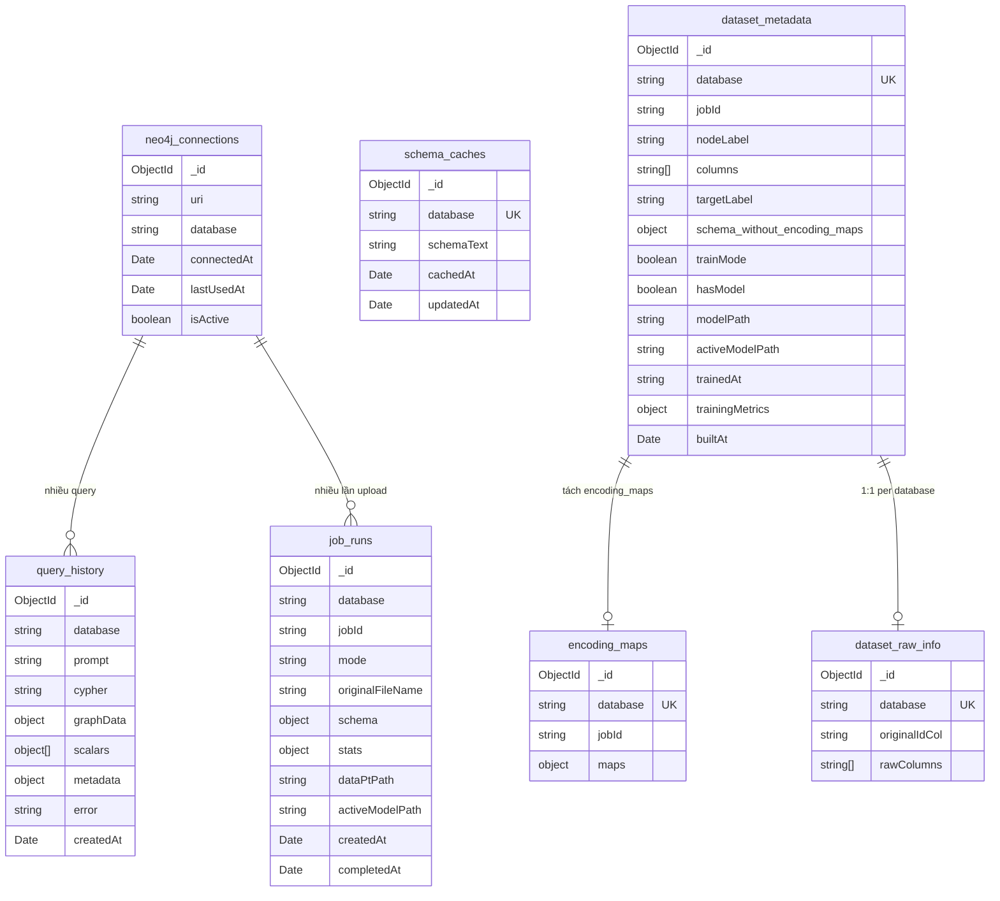

# Tích hợp MongoDB Atlas — Lưu trữ dữ liệu người dùng & loại bỏ file-based storage

## Bối cảnh & Mục tiêu

Hệ thống hiện tại lưu trữ dữ liệu hoàn toàn bằng **file hệ thống** (`.txt`, `.json`, `.csv`) và **localStorage** ở browser. Điều này gây ra:
- Mất data khi clear browser / đổi máy (lịch sử query)
- Không multi-user (chỉ 1 phiên Neo4j driver tại 1 thời điểm)
- File CSV trung gian chiếm nhiều dung lượng (~245MB cho 1 job) nhưng không cần sau khi import xong

**Mục tiêu:** Chuyển sang MongoDB Atlas để lưu trữ persistent, loại bỏ CSV trung gian sau import, giữ lại schema/metadata trên MongoDB.

---

## User Review Required

> [!IMPORTANT]
> **Không có User Authentication**: Plan hiện tại KHÔNG bao gồm đăng ký/đăng nhập. Hệ thống vẫn single-user (giống hiện tại). MongoDB chỉ thay thế file-based storage. Nếu cần auth, cần bổ sung Passport.js/JWT module — scope lớn hơn nhiều.

> [!WARNING]
> **`_latest_neo4j.json` rất lớn (7.2MB)** vì chứa `encoding_maps` (hàng trăm nghìn entries). Khi chuyển sang MongoDB, document này vượt giới hạn 16MB nếu dataset lớn hơn. Plan đề xuất **tách `encoding_maps` thành document riêng** trong collection `encoding_maps` để tránh lỗi.

> [!IMPORTANT]
> **Xóa CSV sau import**: Sau khi ingest Neo4j thành công, sẽ xóa toàn bộ job directory (input.csv, nodes.csv, edges.csv, preprocessed.csv). Chỉ giữ lại `data.pt` (cho GNN inference) và `schema.json` (backup). Bạn có muốn giữ lại file nào khác không?

---

## Open Questions

1. **MongoDB Atlas cluster**: Bạn đã tạo MongoDB Atlas cluster chưa? Nếu chưa, tôi sẽ hướng dẫn tạo free tier (M0).
2. **Giữ `data.pt` ở đâu?**: `data.pt` là file binary (43MB) dùng cho GNN inference. Không thể lưu vào MongoDB (quá lớn). Đề xuất **giữ trên local filesystem** như hiện tại. OK?
3. **Lịch sử query muốn lưu bao nhiêu?**: Hiện tại FE giới hạn 50 entries trên localStorage. Chuyển sang MongoDB có muốn tăng lên (100, 500, unlimited)?

---

## Proposed Changes

### MongoDB Schema Design



### Collections chi tiết — Giải thích từng bảng

---

#### 1️⃣ `schema_caches` — Cache schema Neo4j

**Thay thế file:** `data/schemas/schema_neo4j.txt` (file `.txt` bạn đang mở)

**Tại sao cần?** Mỗi lần Text2Cypher muốn sinh Cypher, nó cần biết cấu trúc graph (có những node nào, relationship nào, property nào). Thay vì query Neo4j mỗi lần (chậm), hệ thống cache schema text lại. Hiện tại lưu file `.txt`, chuyển sang MongoDB.

**Ví dụ document:**
```json
{
  "_id": "ObjectId(...)",
  "database": "neo4j",
  "schemaText": "Node properties:\n- Transaction {node_id: STRING, amt: STRING, ...}\n- MerchantNode {value: STRING}\n...\nRelationship structure:\n- (Transaction)-[:HAS_MERCHANT]->(MerchantNode)\n...",
  "cachedAt": "2026-05-23T16:08:18Z",
  "updatedAt": "2026-05-23T16:13:50Z"
}
```

| Field | Ý nghĩa |
|-------|---------|
| `database` | Tên database Neo4j (VD: `"neo4j"`) — unique key |
| `schemaText` | Nội dung schema dạng text (y hệt nội dung file `schema_neo4j.txt` hiện tại) |
| `cachedAt` | Lần đầu cache |
| `updatedAt` | Lần cuối cập nhật (khi upload CSV mới, schema có thể thay đổi) |

---

#### 2️⃣ `dataset_metadata` — Metadata dataset đang ở trên Neo4j

**Thay thế file:** `data/csv2graph/_latest_neo4j.json`

**Tại sao cần?** Khi user upload CSV và build graph lần đầu (Full Build), hệ thống lưu lại "bản tóm tắt" của dataset đó: node chính tên gì, có những cột nào, model đã train chưa... Để lần sau khi user upload thêm CSV (Append), hệ thống biết phải dùng schema nào.

**File hiện tại `_latest_neo4j.json` chứa gì?** (7.2MB vì `encoding_maps` rất lớn)
```json
{
  "jobId": "2026-05-23T16-08-18-823Z_fraudTrain_part1_75bceb4d",
  "nodeLabel": "Transaction",
  "columns": ["node_id", "amt", "lat", "long", "city_pop", ...],
  "targetLabel": "is_fraud",
  "schema": {
    "node_id": "node_id",
    "relation_cols": ["merchant", "category", "gender", "state", "job"],
    "feature_cols": ["amt", "lat", "long", ...],
    "encoded_feature_cols": ["amt", "lat", "long", ...],
    "encoding_maps": { ... },  // ← ĐÂY LÀ PHẦN RẤT LỚN (7MB), sẽ tách ra
    "target_label": "is_fraud",
    "train_ratio": 0.4,
    "val_ratio": 0.2,
    "seed": 42,
    "max_group_size": 500
  },
  "hasModel": true,
  "builtAt": "2026-05-23T16:08:18Z"
}
```

**Trên MongoDB, document `dataset_metadata` sẽ lưu Y HỆT nhưng BỎ `encoding_maps`:**

```json
{
  "_id": "ObjectId(...)",
  "database": "neo4j",
  "jobId": "2026-05-23T16-08-18-823Z_fraudTrain_part1_75bceb4d",
  "nodeLabel": "Transaction",
  "columns": ["node_id", "amt", "lat", "long", "city_pop", "merch_lat", "merch_long", "unix_time", "zip", "trans_date_trans_time", "is_fraud"],
  "targetLabel": "is_fraud",
  "schema": {
    "node_id": "node_id",
    "relation_cols": ["merchant", "category", "gender", "state", "job"],
    "feature_cols": ["amt", "lat", "long", "city_pop", "merch_lat", "merch_long", "unix_time", "zip", "trans_date_trans_time"],
    "encoded_feature_cols": ["amt", "lat", "long", "city_pop", "merch_lat", "merch_long", "unix_time", "zip", "trans_date_trans_time"],
    "target_label": "is_fraud",
    "train_ratio": 0.4,
    "val_ratio": 0.2,
    "seed": 42,
    "max_group_size": 500
  },
  "trainMode": true,
  "hasModel": true,
  "modelPath": "data/csv2graph/.../best_model.pt",
  "activeModelPath": "../python-services/models/fgnn_star.pt",
  "trainedAt": "2026-05-23T16:10:00Z",
  "trainingMetrics": { "val": { "f1": 0.85, "auc": 0.92 } },
  "builtAt": "2026-05-23T16:08:18Z"
}
```

| Field | Ý nghĩa |
|-------|---------|
| `database` | Database Neo4j đang dùng — unique key |
| `jobId` | ID của lần build đầu tiên (dùng để tìm job directory trên disk) |
| `nodeLabel` | Label node chính (VD: `"Transaction"`) — dùng cho preview graph + Cypher |
| `columns` | Danh sách cột sau khi rename (node_id, features, target) |
| `targetLabel` | Cột nhãn fraud (VD: `"is_fraud"`) |
| `schema` | Cấu hình pipeline: cột nào là feature, cột nào là relation, tỷ lệ train/val/test... |
| `trainMode` | User có chọn train GNN khi upload không |
| `hasModel` | Đã có model GNN train xong chưa |
| `modelPath` | Đường dẫn file model weights (VD: `best_model.pt`) |
| `activeModelPath` | Model đang active cho inference |
| `trainingMetrics` | Kết quả training (F1, AUC...) |
| `builtAt` | Thời điểm build dataset |

---

#### 3️⃣ `encoding_maps` — Bảng mã hóa categorical (TÁCH RIÊNG vì quá lớn)

**Thay thế:** Phần `encoding_maps` bên trong `_latest_neo4j.json`

**Tại sao phải tách?** `encoding_maps` chứa bảng mapping mỗi giá trị categorical → số float (Target Encoding). VD: mỗi timestamp `"1/1/2019 0:00"` → `0`, mỗi merchant name → fraud rate... File hiện tại có **hàng trăm nghìn entries**, chiếm 7MB. MongoDB giới hạn 16MB/document → dataset lớn hơn sẽ vỡ.

**Ví dụ document:**
```json
{
  "_id": "ObjectId(...)",
  "database": "neo4j",
  "jobId": "2026-05-23T16-08-18-823Z_fraudTrain_part1_75bceb4d",
  "maps": {
    "trans_date_trans_time": {
      "1/1/2019 0:00": 0,
      "1/1/2019 0:01": 0,
      "1/1/2019 12:30": 0.023,
      "__MISSING__": 0.0058
    },
    "zip": {
      "28654": 0.01,
      "10001": 0.008,
      "__MISSING__": 0.0058
    }
  }
}
```

**Khi nào cần?** Chỉ khi chạy Append mode (upload CSV mới) — hệ thống dùng maps này để encode các giá trị categorical trong CSV mới giống hệt lần build đầu, rồi mới inference được.

---

#### 4️⃣ `dataset_raw_info` — Thông tin CSV gốc (cho append validation)

**Thay thế file:** `data/csv2graph/_raw_neo4j.json`

**Tại sao cần?** Khi user upload CSV lần 2 (append), hệ thống cần kiểm tra: "CSV mới có đủ các cột giống CSV gốc không?" Nếu thiếu cột bắt buộc → báo lỗi. Nếu thừa cột → silent drop.

**Ví dụ document (y hệt file `_raw_neo4j.json` hiện tại):**
```json
{
  "_id": "ObjectId(...)",
  "database": "neo4j",
  "originalIdCol": "transaction_id",
  "rawColumns": [
    "transaction_id", "trans_date_trans_time", "cc_num", "merchant",
    "category", "amt", "first", "last", "gender", "street", "city",
    "state", "zip", "lat", "long", "city_pop", "job", "dob",
    "trans_num", "unix_time", "merch_lat", "merch_long", "is_fraud"
  ]
}
```

| Field | Ý nghĩa |
|-------|---------|
| `database` | Database Neo4j — unique key |
| `originalIdCol` | Cột nào trong CSV gốc là ID giao dịch (VD: `"transaction_id"`) — user chọn khi upload |
| `rawColumns` | Toàn bộ tên cột của CSV gốc (chưa rename, chưa encode) — 23 cột |

---

#### 5️⃣ `query_history` — Lịch sử hỏi đáp NL → Cypher (MỚI — thay localStorage)

**Thay thế:** `localStorage["query-history"]` trên browser

**Tại sao chuyển?** Hiện tại lịch sử query lưu trong browser localStorage → clear cache là mất hết, đổi trình duyệt cũng mất. Chuyển sang MongoDB → persistent, không mất.

**Ví dụ document:**
```json
{
  "_id": "ObjectId(...)",
  "database": "neo4j",
  "prompt": "Tìm top 10 merchant liên quan đến nhiều giao dịch fraud nhất",
  "cypher": "MATCH (t:Transaction)-[:HAS_MERCHANT]->(m:MerchantNode)\nWHERE t.is_fraud = '1'\nRETURN m.value AS merchant, count(t) AS fraud_count\nORDER BY fraud_count DESC LIMIT 10",
  "graphData": {
    "nodes": [
      { "id": "123", "label": "MerchantNode", "properties": { "value": "fraud_Rippin..." } }
    ],
    "links": []
  },
  "scalars": [
    { "merchant": "fraud_Rippin...", "fraud_count": 85 },
    { "merchant": "fraud_Swaniawski...", "fraud_count": 72 }
  ],
  "metadata": {
    "retries": 0,
    "cypherV1": "MATCH ...",
    "cypherV2": "MATCH ..."
  },
  "error": null,
  "createdAt": "2026-05-26T13:15:00Z"
}
```

| Field | Ý nghĩa |
|-------|---------|
| `database` | Database nào đang query |
| `prompt` | Câu hỏi NL user nhập (tiếng Việt) |
| `cypher` | Cypher query mà AI sinh ra |
| `graphData` | Kết quả graph (nodes + links) — dùng để hiển thị lại đồ thị khi click history |
| `scalars` | Kết quả dạng bảng (VD: merchant name + fraud count) |
| `metadata` | Thông tin debug: AI retry mấy lần, cypher V1 vs V2 |
| `error` | Nếu query fail → lưu error message |
| `createdAt` | Thời điểm query |

---

#### 6️⃣ `job_runs` — Lịch sử upload CSV & kết quả pipeline (MỚI)

**Thay thế:** Không có (chức năng MỚI)

**Tại sao cần?** Hiện tại khi user upload CSV, kết quả pipeline (bao nhiêu node, bao nhiêu edge, train model ra sao, inference ra sao) chỉ hiển thị 1 lần rồi biến mất. Collection này lưu lại toàn bộ để user xem lại lịch sử.

**Ví dụ document:**
```json
{
  "_id": "ObjectId(...)",
  "database": "neo4j",
  "jobId": "2026-05-23T16-08-18-823Z_fraudTrain_part1_75bceb4d",
  "mode": "full",
  "originalFileName": "fraudTrain_part1.csv",
  "stats": {
    "inputRows": 500000,
    "numNodes": 500000,
    "numEdges": 2450000,
    "numFeatures": 9,
    "numEncodedFeatures": 9,
    "numRelationTypes": 5,
    "ingested": { "nodes": 500000, "relationships": 2450000 },
    "inference": null
  },
  "dataPtPath": "data/csv2graph/.../data.pt",
  "training": {
    "success": true,
    "epochsRun": 145,
    "bestMetric": 0.85,
    "metrics": { "val": { "f1": 0.85 }, "test": { "f1": 0.83 } }
  },
  "createdAt": "2026-05-23T16:08:18Z",
  "completedAt": "2026-05-23T16:13:50Z"
}
```

| Field | Ý nghĩa |
|-------|---------|
| `jobId` | ID unique cho lần upload này |
| `mode` | `"full"` = build từ đầu, `"append"` = thêm data vào DB đã có |
| `originalFileName` | Tên file CSV user upload |
| `stats` | Thống kê: bao nhiêu rows, nodes, edges, features |
| `training` | Kết quả train GNN (nếu có): epochs, F1 score, AUC... |
| `createdAt` / `completedAt` | Thời gian bắt đầu → hoàn thành |

---

#### 7️⃣ `neo4j_connections` — Lưu connection Neo4j gần nhất

**Thay thế:** `localStorage["neo4j-connection"]` trên browser

**Tại sao cần?** Hiện tại FE lưu URI + database vào localStorage để tự fill lại form khi reload. Chuyển sang MongoDB → server nhớ thay cho browser.

**Ví dụ document:**
```json
{
  "_id": "ObjectId(...)",
  "uri": "bolt://localhost:7687",
  "database": "neo4j",
  "connectedAt": "2026-05-26T13:15:00Z",
  "lastUsedAt": "2026-05-26T13:45:00Z",
  "isActive": true
}
```

| Field | Ý nghĩa |
|-------|---------|
| `uri` | URI kết nối Neo4j (VD: `bolt://localhost:7687`) |
| `database` | Database đang dùng |
| `connectedAt` | Lần đầu kết nối |
| `lastUsedAt` | Lần cuối dùng (cập nhật mỗi lần query) |
| `isActive` | Đang active hay đã disconnect |

---

### Tổng kết mapping: File hiện tại → MongoDB

| Hiện tại (file/localStorage) | → MongoDB Collection | Kích thước |
|------------------------------|---------------------|------------|
| `data/schemas/schema_neo4j.txt` | `schema_caches` | ~1KB |
| `data/csv2graph/_latest_neo4j.json` (trừ encoding_maps) | `dataset_metadata` | ~2KB |
| `data/csv2graph/_latest_neo4j.json` (phần encoding_maps) | `encoding_maps` | ~7MB |
| `data/csv2graph/_raw_neo4j.json` | `dataset_raw_info` | ~400B |
| `localStorage["query-history"]` | `query_history` | Tùy số query |
| *(không có)* | `job_runs` | Tùy số lần upload |
| `localStorage["neo4j-connection"]` | `neo4j_connections` | ~200B |

---

### Component 1: Cài đặt & Config MongoDB

#### [NEW] MongoDB Atlas Setup Guide

Hướng dẫn step-by-step:

1. **Tạo account** MongoDB Atlas tại https://cloud.mongodb.com
2. **Tạo cluster** Free Tier (M0 Sandbox, 512MB)
   - Provider: AWS / GCP
   - Region: Singapore (gần VN nhất)
3. **Tạo Database User**
   - Username: `kltn_admin`  
   - Password: (auto-generate)
   - Role: `Atlas admin` (hoặc `readWrite` trên database `fraud_detection`)
4. **Whitelist IP**: Add `0.0.0.0/0` (cho development) hoặc IP cụ thể
5. **Lấy Connection String**: 
   - Click "Connect" → "Drivers" → Copy URI
   - Format: `mongodb+srv://kltn_admin:<password>@cluster0.xxxxx.mongodb.net/fraud_detection?retryWrites=true&w=majority`
6. **Thêm vào `.env`**:
   ```
   MONGODB_URI=mongodb+srv://kltn_admin:<password>@cluster0.xxxxx.mongodb.net/fraud_detection?retryWrites=true&w=majority
   ```

#### [MODIFY] [.env](file:///l:/Học%20Tập/KLTN/FraudDetection/Web-KLTN/backend-kltn/.env)
- Thêm `MONGODB_URI`

#### [MODIFY] [package.json](file:///l:/Học%20Tập/KLTN/FraudDetection/Web-KLTN/backend-kltn/package.json)
- Thêm dependencies: `@nestjs/mongoose`, `mongoose`

---

### Component 2: MongoDB Module (NestJS)

#### [NEW] `src/mongodb/mongodb.module.ts`
- Import `MongooseModule.forRootAsync()` kết nối MongoDB Atlas
- Sử dụng `ConfigService` để lấy URI từ `.env`

#### [NEW] `src/mongodb/schemas/schema-cache.schema.ts`
```typescript
// Mongoose schema cho collection schema_caches
{
  database: { type: String, unique: true, required: true },
  schemaText: { type: String, required: true },
  cachedAt: { type: Date, default: Date.now },
  updatedAt: { type: Date, default: Date.now },
}
```

#### [NEW] `src/mongodb/schemas/dataset-metadata.schema.ts`
```typescript
// Mongoose schema cho collection dataset_metadata
{
  database: { type: String, unique: true, required: true },
  jobId: String,
  nodeLabel: String,
  columns: [String],
  targetLabel: String,
  schema: Object,  // FullSchema KHÔNG bao gồm encoding_maps
  trainMode: Boolean,
  hasModel: Boolean,
  modelPath: String,
  activeModelPath: String,
  trainedAt: String,
  trainingMetrics: Object,
  builtAt: Date,
}
```

#### [NEW] `src/mongodb/schemas/dataset-raw-info.schema.ts`
#### [NEW] `src/mongodb/schemas/encoding-map.schema.ts`
#### [NEW] `src/mongodb/schemas/query-history.schema.ts`
#### [NEW] `src/mongodb/schemas/job-run.schema.ts`
#### [NEW] `src/mongodb/schemas/neo4j-connection.schema.ts`

---

### Component 3: Migrate DatasetMetaService → MongoDB

#### [MODIFY] [dataset-meta.service.ts](file:///l:/Học%20Tập/KLTN/FraudDetection/Web-KLTN/backend-kltn/src/csv2graph/dataset-meta.service.ts)

Thay đổi lớn nhất:
- `loadLatest()`: Đọc từ MongoDB thay vì `_latest_<db>.json`
- `saveLatest()`: Ghi vào MongoDB, tách `encoding_maps` sang collection riêng
- `loadRawInfo()` / `saveRawInfo()`: Đọc/ghi từ MongoDB thay vì `_raw_<db>.json`
- Xóa tất cả `fs.readFileSync` / `fs.writeFileSync` / `fs.existsSync`

---

### Component 4: Migrate SchemaService → MongoDB

#### [MODIFY] [schema.service.ts](file:///l:/Học%20Tập/KLTN/FraudDetection/Web-KLTN/backend-kltn/src/text2cypher/schema.service.ts)

- `loadCachedSchema()`: Đọc từ collection `schema_caches` thay vì file `.txt`
- `saveSchemaToDisk()` → `saveSchemaToDb()`: Ghi vào MongoDB
- Xóa `getCacheFilePath()`, `getCacheFileName()`

#### [MODIFY] [neo4j.service.ts](file:///l:/Học%20Tập/KLTN/FraudDetection/Web-KLTN/backend-kltn/src/neo4j/neo4j.service.ts)

- `schemaCacheExists()`: Kiểm tra MongoDB thay vì file
- `schemaCacheFilePath()` / `schemaCacheFileName()`: Xóa (không cần nữa)
- Inject `MongoDBService` hoặc schema cache repository

---

### Component 5: Query History (Server-side)

#### [NEW] `src/history/history.module.ts`
#### [NEW] `src/history/history.service.ts`
- `saveQuery()`: Lưu prompt + cypher + graphData + scalars + metadata
- `getHistory()`: Trả danh sách (phân trang, mặc định 50)
- `clearHistory()`: Xóa toàn bộ

#### [NEW] `src/history/history.controller.ts`
- `POST /history` — lưu entry mới
- `GET /history?limit=50&offset=0` — lấy danh sách
- `DELETE /history` — xóa toàn bộ
- `DELETE /history/:id` — xóa 1 entry

#### [MODIFY] Frontend: `historyStore.ts`
- Chuyển từ localStorage → gọi API backend
- `useHistoryStore` gọi `POST /history` khi có query mới
- Load history từ server khi app init thay vì localStorage

#### [MODIFY] Frontend: `api/endpoint.ts`
- Thêm các endpoint history

#### [MODIFY] Frontend: `types/index.ts`
- Thêm response types cho history API

---

### Component 6: Xóa CSV sau Import

#### [MODIFY] [csv2graph.service.ts](file:///l:/Học%20Tập/KLTN/FraudDetection/Web-KLTN/backend-kltn/src/csv2graph/csv2graph.service.ts)

Sau khi `neo4jIngest.ingest()` thành công:
```typescript
// Xóa file CSV trung gian, chỉ giữ data.pt + schema.json
this.csvOutput.cleanupJobDir(jobDir, ['data.pt', 'schema.json']);
```

#### [MODIFY] [csv-output.service.ts](file:///l:/Học%20Tập/KLTN/FraudDetection/Web-KLTN/backend-kltn/src/csv2graph/csv-output.service.ts)
- Thêm method `cleanupJobDir(jobDir, keepFiles)` 
- Xóa: `input.csv`, `nodes.csv`, `edges.csv`, `preprocessed.csv`
- Giữ: `data.pt` (43MB, cần cho GNN), `schema.json` (backup metadata)

---

### Component 7: Lưu Job Runs History

#### [MODIFY] [csv2graph.service.ts](file:///l:/Học%20Tập/KLTN/FraudDetection/Web-KLTN/backend-kltn/src/csv2graph/csv2graph.service.ts)

Sau khi hoàn tất fullBuild/appendBuild:
```typescript
await this.jobRunService.saveJobRun({
  database,
  jobId,
  mode: 'full' | 'append',
  originalFileName,
  schema: fullSchema,
  stats,
  dataPtPath: files.dataPt,
  training,
  inference,
});
```

---

### Component 8: Lưu Neo4j Connection (tùy chọn)

#### [MODIFY] [neo4j.controller.ts](file:///l:/Học%20Tập/KLTN/FraudDetection/Web-KLTN/backend-kltn/src/neo4j/neo4j.controller.ts)

Khi connect thành công, lưu connection info vào MongoDB:
```typescript
await this.connectionRepo.upsert({
  uri, database, connectedAt: new Date(), isActive: true
});
```

Khi FE load lại (`GET /neo4j/status`), nếu driver chưa connect nhưng MongoDB có connection gần nhất → auto-suggest trên FE.

---

### Component 9: Update AppModule

#### [MODIFY] [app.module.ts](file:///l:/Học%20Tập/KLTN/FraudDetection/Web-KLTN/backend-kltn/src/app.module.ts)

```typescript
imports: [
  ConfigModule.forRoot({ isGlobal: true }),
  MongooseModule.forRootAsync({
    imports: [ConfigModule],
    useFactory: (config: ConfigService) => ({
      uri: config.get<string>('MONGODB_URI'),
    }),
    inject: [ConfigService],
  }),
  EventEmitterModule.forRoot(),
  MongoDbModule,      // NEW
  HistoryModule,       // NEW
  Neo4jModule,
  GraphModule,
  AiModule,
  Text2CypherModule,
  Csv2GraphModule,
],
```

---

## Tổng kết File Changes

| Action | File | Mô tả |
|--------|------|--------|
| NEW | `src/mongodb/mongodb.module.ts` | MongoDB module chính |
| NEW | `src/mongodb/schemas/*.schema.ts` (7 files) | Mongoose schemas |
| NEW | `src/history/history.module.ts` | History module |
| NEW | `src/history/history.service.ts` | CRUD lịch sử query |
| NEW | `src/history/history.controller.ts` | REST endpoints |
| MODIFY | `src/app.module.ts` | Import MongoDB + History |
| MODIFY | `src/csv2graph/dataset-meta.service.ts` | File → MongoDB |
| MODIFY | `src/csv2graph/csv2graph.service.ts` | Cleanup CSV + save job run |
| MODIFY | `src/csv2graph/csv-output.service.ts` | Thêm cleanupJobDir() |
| MODIFY | `src/text2cypher/schema.service.ts` | File → MongoDB |
| MODIFY | `src/neo4j/neo4j.service.ts` | Schema cache → MongoDB |
| MODIFY | `src/neo4j/neo4j.controller.ts` | Save connection info |
| MODIFY | `.env` + `.env.example` | Thêm MONGODB_URI |
| MODIFY | `package.json` | Thêm mongoose deps |
| MODIFY | FE: `store/historyStore.ts` | localStorage → API |
| MODIFY | FE: `api/endpoint.ts` | Thêm history endpoints |
| MODIFY | FE: `types/index.ts` | Thêm history types |

---

## Verification Plan

### Automated Tests
1. `npm run build` — build thành công
2. Connect MongoDB Atlas → verify connection log
3. Upload CSV → verify metadata lưu vào MongoDB (kiểm tra Atlas Data Explorer)
4. Verify CSV files bị xóa sau import (chỉ còn `data.pt` + `schema.json`)
5. Gửi NL query → verify schema cache lưu vào MongoDB
6. Verify query history lưu trên MongoDB (không mất khi clear browser)
7. Verify append mode vẫn hoạt động (đọc `_raw_info` từ MongoDB)

### Manual Verification
- Mở MongoDB Atlas → Data Explorer → kiểm tra 7 collections
- Clear browser localStorage → reload → verify lịch sử query vẫn còn
- Upload CSV lần 2 (append) → verify không cần file `_raw_<db>.json` local
