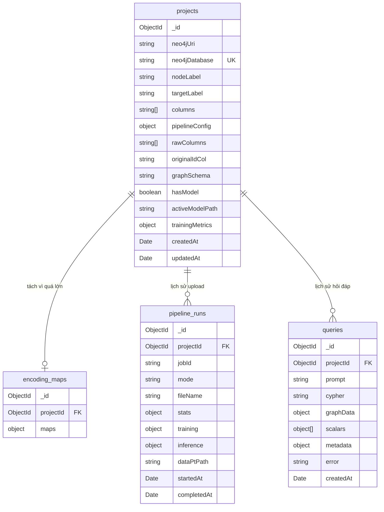

# Tích hợp MongoDB Atlas — Redesign theo chức năng hệ thống

## Bối cảnh

Hệ thống hiện tại lưu trữ bằng file (`.txt`, `.json`, `.csv`) và `localStorage`. Mục tiêu: chuyển sang MongoDB Atlas, thiết kế database theo **chức năng hệ thống**, không phải theo file.

---

## User Review Required

> [!IMPORTANT]
> **Không có Authentication**: Hệ thống vẫn single-user. MongoDB chỉ thay thế file storage.

> [!IMPORTANT]
> **`data.pt` (43MB)**: File binary PyTorch — giữ trên local filesystem, không lưu MongoDB.

> [!WARNING]
> **Xóa CSV sau import**: Xóa `input.csv`, `nodes.csv`, `edges.csv`, `preprocessed.csv` sau khi ingest thành công. Chỉ giữ `data.pt` + `schema.json` trên disk.

## Open Questions

1. Bạn đã tạo MongoDB Atlas cluster chưa?
2. Giới hạn lịch sử query: 50? 100? Unlimited?

---

## MongoDB Schema Design — 4 Collections theo chức năng

Hệ thống có **4 chức năng chính**, mỗi chức năng = 1 collection:



---

### 1️⃣ `projects` — Không gian làm việc phát hiện gian lận

**Câu hỏi nó trả lời:** *"Dataset hiện tại của tôi trông như thế nào? Cấu hình pipeline ra sao? Model đã train chưa? Schema graph là gì?"*

Đây là **entity trung tâm** — gom tất cả thông tin về 1 workspace fraud detection gắn với 1 Neo4j database. Thay vì tán ra 4 file (`_latest_*.json`, `_raw_*.json`, `schema_*.txt`, `localStorage`), tất cả nằm trong 1 document.

**Ví dụ document:**
```json
{
  "_id": "ObjectId(...)",

  "neo4jUri": "bolt://localhost:7687",
  "neo4jDatabase": "neo4j",

  "nodeLabel": "Transaction",
  "targetLabel": "is_fraud",
  "columns": ["node_id", "amt", "lat", "long", "city_pop", "merch_lat",
              "merch_long", "unix_time", "zip", "trans_date_trans_time", "is_fraud"],

  "pipelineConfig": {
    "relationCols": ["merchant", "category", "gender", "state", "job"],
    "featureCols": ["amt", "lat", "long", "city_pop", "merch_lat", "merch_long",
                    "unix_time", "zip", "trans_date_trans_time"],
    "encodedFeatureCols": ["amt", "lat", "long", "city_pop", "merch_lat",
                           "merch_long", "unix_time", "zip", "trans_date_trans_time"],
    "trainRatio": 0.4,
    "valRatio": 0.2,
    "seed": 42,
    "maxGroupSize": 500
  },

  "rawColumns": ["transaction_id", "trans_date_trans_time", "cc_num", "merchant",
                 "category", "amt", "first", "last", "gender", "street", "city",
                 "state", "zip", "lat", "long", "city_pop", "job", "dob",
                 "trans_num", "unix_time", "merch_lat", "merch_long", "is_fraud"],
  "originalIdCol": "transaction_id",

  "graphSchema": "Node properties:\n- Transaction {node_id: STRING, amt: STRING, ...}\n...",

  "hasModel": true,
  "activeModelPath": "../python-services/models/fgnn_star.pt",
  "trainingMetrics": { "val": { "f1": 0.85, "auc": 0.92 } },

  "createdAt": "2026-05-23T16:08:18Z",
  "updatedAt": "2026-05-26T13:15:00Z"
}
```

| Nhóm field | Fields | Ý nghĩa |
|-----------|--------|---------|
| **Neo4j Connection** | `neo4jUri`, `neo4jDatabase` | Kết nối Neo4j nào đang gắn với project |
| **Dataset** | `nodeLabel`, `targetLabel`, `columns` | Node chính tên gì, cột nhãn fraud, danh sách cột |
| **Pipeline Config** | `pipelineConfig.*` | Cấu hình pipeline: cột feature/relation, tỷ lệ train/val |
| **Append Validation** | `rawColumns`, `originalIdCol` | Headers CSV gốc + cột ID — dùng validate khi upload CSV mới |
| **Graph Schema** | `graphSchema` | Schema text cho Text2Cypher (cache, tránh query Neo4j mỗi lần) |
| **Model** | `hasModel`, `activeModelPath`, `trainingMetrics` | GNN model đã train chưa, kết quả F1/AUC |

---

### 2️⃣ `encoding_maps` — Bảng mã hóa categorical

**Câu hỏi nó trả lời:** *"Khi có CSV mới (append), encode giá trị categorical thế nào cho khớp với lần build đầu?"*

Tách riêng khỏi `projects` vì **quá lớn** (7MB+ — hàng trăm nghìn entries mapping giá trị → float). Nếu nhúng vào `projects` sẽ vượt giới hạn 16MB/document của MongoDB khi dataset lớn hơn.

**Chỉ cần đọc khi chạy Append mode** (upload CSV mới mà DB đã có data).

```json
{
  "_id": "ObjectId(...)",
  "projectId": "ObjectId(ref → projects._id)",
  "maps": {
    "trans_date_trans_time": {
      "1/1/2019 0:00": 0,
      "1/1/2019 12:30": 0.023,
      "__MISSING__": 0.0058
    },
    "zip": { "28654": 0.01, "10001": 0.008, "__MISSING__": 0.0058 }
  }
}
```

---

### 3️⃣ `pipeline_runs` — Lịch sử upload CSV & kết quả pipeline

**Câu hỏi nó trả lời:** *"Tôi đã upload bao nhiêu file CSV? Mỗi lần kết quả ra sao? Train model thế nào?"*

Hiện tại hệ thống **không lưu lịch sử này** — kết quả pipeline chỉ hiển thị 1 lần rồi mất. Collection này giúp user xem lại toàn bộ lịch sử.

```json
{
  "_id": "ObjectId(...)",
  "projectId": "ObjectId(ref → projects._id)",
  "jobId": "2026-05-23T16-08-18-823Z_fraudTrain_part1_75bceb4d",
  "mode": "full",
  "fileName": "fraudTrain_part1.csv",
  "stats": {
    "inputRows": 500000,
    "numNodes": 500000,
    "numEdges": 2450000,
    "numFeatures": 9,
    "ingested": { "nodes": 500000, "relationships": 2450000 }
  },
  "training": {
    "success": true,
    "epochsRun": 145,
    "bestMetric": 0.85,
    "metrics": { "val": { "f1": 0.85 }, "test": { "f1": 0.83 } }
  },
  "inference": null,
  "dataPtPath": "data/csv2graph/.../data.pt",
  "startedAt": "2026-05-23T16:08:18Z",
  "completedAt": "2026-05-23T16:13:50Z"
}
```

| Field | Ý nghĩa |
|-------|---------|
| `mode` | `"full"` = build từ đầu, `"append"` = thêm data |
| `fileName` | Tên file CSV user upload |
| `stats` | Thống kê: rows, nodes, edges, features |
| `training` | Kết quả train GNN: epochs, F1, AUC (null nếu không train) |
| `inference` | Kết quả inference append (null nếu full build) |

---

### 4️⃣ `queries` — Lịch sử hỏi đáp NL → Cypher

**Câu hỏi nó trả lời:** *"Tôi đã hỏi những câu gì? AI sinh Cypher gì? Kết quả graph ra sao?"*

Thay thế `localStorage["query-history"]` → persistent trên server, không mất khi clear browser.

```json
{
  "_id": "ObjectId(...)",
  "projectId": "ObjectId(ref → projects._id)",
  "prompt": "Tìm top 10 merchant liên quan đến nhiều giao dịch fraud nhất",
  "cypher": "MATCH (t:Transaction)-[:HAS_MERCHANT]->(m:MerchantNode)\nWHERE t.is_fraud = '1'\nRETURN m.value, count(t) AS cnt ORDER BY cnt DESC LIMIT 10",
  "graphData": { "nodes": [...], "links": [...] },
  "scalars": [{ "merchant": "fraud_Rippin...", "cnt": 85 }],
  "metadata": { "retries": 0, "cypherV1": "...", "cypherV2": "..." },
  "error": null,
  "createdAt": "2026-05-26T13:15:00Z"
}
```

---

### So sánh: Thiết kế cũ (7 bảng theo file) vs Thiết kế mới (4 bảng theo chức năng)

| Thiết kế cũ (theo file) | Thiết kế mới (theo chức năng) |
|-------------------------|-------------------------------|
| `schema_caches` | → Nhúng vào `projects.graphSchema` |
| `dataset_metadata` | → Nhúng vào `projects` (nodeLabel, columns, model...) |
| `dataset_raw_info` | → Nhúng vào `projects` (rawColumns, originalIdCol) |
| `encoding_maps` | → `encoding_maps` (giữ riêng vì quá lớn) |
| `query_history` | → `queries` |
| `job_runs` | → `pipeline_runs` |
| `neo4j_connections` | → Nhúng vào `projects` (neo4jUri, neo4jDatabase) |

**Kết quả: 7 bảng → 4 bảng.** `projects` là trung tâm, gom mọi thông tin liên quan đến 1 workspace.

---

## Proposed Changes

### Component 1: MongoDB Atlas Setup

1. Tạo account tại https://cloud.mongodb.com
2. Tạo cluster Free Tier (M0, Singapore region)
3. Tạo Database User (`kltn_admin` / auto-generated password)
4. Whitelist IP: `0.0.0.0/0` (development)
5. Copy connection string → thêm vào `.env`:
   ```
   MONGODB_URI=mongodb+srv://kltn_admin:<password>@cluster0.xxxxx.mongodb.net/fraud_detection?retryWrites=true&w=majority
   ```

#### [MODIFY] [.env](file:///l:/Học%20Tập/KLTN/FraudDetection/Web-KLTN/backend-kltn/.env)
- Thêm `MONGODB_URI`

#### [MODIFY] [package.json](file:///l:/Học%20Tập/KLTN/FraudDetection/Web-KLTN/backend-kltn/package.json)
- Thêm: `@nestjs/mongoose`, `mongoose`

---

### Component 2: MongoDB Module + Schemas

#### [NEW] `src/mongodb/mongodb.module.ts`
- `MongooseModule.forRootAsync()` kết nối Atlas via `ConfigService`

#### [NEW] `src/mongodb/schemas/project.schema.ts`
#### [NEW] `src/mongodb/schemas/encoding-map.schema.ts`
#### [NEW] `src/mongodb/schemas/pipeline-run.schema.ts`
#### [NEW] `src/mongodb/schemas/query.schema.ts`

---

### Component 3: ProjectService (thay DatasetMetaService + SchemaService cache)

#### [NEW] `src/mongodb/project.service.ts`

Gom logic từ `DatasetMetaService` + `SchemaService` cache:
- `findByDatabase(db)` → thay `loadLatest()` + `loadRawInfo()` + `loadCachedSchema()`
- `upsert(db, data)` → thay `saveLatest()` + `saveRawInfo()` + `saveSchemaToDisk()`
- `getEncodingMaps(projectId)` → thay đọc encoding_maps từ `_latest_*.json`
- `saveEncodingMaps(projectId, maps)` → tách lưu riêng

#### [MODIFY] [dataset-meta.service.ts](file:///l:/Học%20Tập/KLTN/FraudDetection/Web-KLTN/backend-kltn/src/csv2graph/dataset-meta.service.ts)
- Xóa tất cả `fs.*` code, delegate sang `ProjectService`

#### [MODIFY] [schema.service.ts](file:///l:/Học%20Tập/KLTN/FraudDetection/Web-KLTN/backend-kltn/src/text2cypher/schema.service.ts)
- `loadCachedSchema()` → `projectService.findByDatabase(db).graphSchema`
- `saveSchemaToDisk()` → `projectService.updateGraphSchema(db, text)`

#### [MODIFY] [neo4j.service.ts](file:///l:/Học%20Tập/KLTN/FraudDetection/Web-KLTN/backend-kltn/src/neo4j/neo4j.service.ts)
- `schemaCacheExists()` → check `projectService.findByDatabase(db)?.graphSchema`
- Xóa `schemaCacheFilePath()`, `schemaCacheFileName()`

---

### Component 4: Query History (server-side)

#### [NEW] `src/history/history.module.ts`
#### [NEW] `src/history/history.service.ts`
- `save(projectId, data)`, `list(projectId, limit, offset)`, `delete(id)`, `clear(projectId)`

#### [NEW] `src/history/history.controller.ts`
- `POST /history`, `GET /history`, `DELETE /history/:id`, `DELETE /history`

#### [MODIFY] FE: `store/historyStore.ts` — localStorage → API calls
#### [MODIFY] FE: `api/endpoint.ts` — thêm history endpoints
#### [MODIFY] FE: `types/index.ts` — thêm history response types

---

### Component 5: Pipeline Run History

#### [MODIFY] [csv2graph.service.ts](file:///l:/Học%20Tập/KLTN/FraudDetection/Web-KLTN/backend-kltn/src/csv2graph/csv2graph.service.ts)
- Sau fullBuild/appendBuild → lưu `pipeline_runs` document
- Sau ingest thành công → `csvOutput.cleanupJobDir(jobDir, ['data.pt', 'schema.json'])`

#### [MODIFY] [csv-output.service.ts](file:///l:/Học%20Tập/KLTN/FraudDetection/Web-KLTN/backend-kltn/src/csv2graph/csv-output.service.ts)
- Thêm `cleanupJobDir(jobDir, keepFiles)` — xóa CSV trung gian

---

### Component 6: Update AppModule

#### [MODIFY] [app.module.ts](file:///l:/Học%20Tập/KLTN/FraudDetection/Web-KLTN/backend-kltn/src/app.module.ts)

```typescript
imports: [
  ConfigModule.forRoot({ isGlobal: true }),
  MongooseModule.forRootAsync({
    imports: [ConfigModule],
    useFactory: (config: ConfigService) => ({
      uri: config.get<string>('MONGODB_URI'),
    }),
    inject: [ConfigService],
  }),
  EventEmitterModule.forRoot(),
  MongoDbModule,       // NEW
  HistoryModule,       // NEW
  Neo4jModule, GraphModule, AiModule, Text2CypherModule, Csv2GraphModule,
],
```

---

## Tổng kết File Changes

| Action | File | Mô tả |
|--------|------|--------|
| NEW | `src/mongodb/mongodb.module.ts` | MongoDB connection module |
| NEW | `src/mongodb/schemas/*.schema.ts` (4 files) | Mongoose schemas |
| NEW | `src/mongodb/project.service.ts` | CRUD cho projects + encoding_maps |
| NEW | `src/history/history.{module,service,controller}.ts` | Query history API |
| MODIFY | `src/app.module.ts` | Import MongoDB + History modules |
| MODIFY | `src/csv2graph/dataset-meta.service.ts` | File → ProjectService |
| MODIFY | `src/csv2graph/csv2graph.service.ts` | Save pipeline_run + cleanup CSV |
| MODIFY | `src/csv2graph/csv-output.service.ts` | Thêm cleanupJobDir() |
| MODIFY | `src/text2cypher/schema.service.ts` | File cache → ProjectService |
| MODIFY | `src/neo4j/neo4j.service.ts` | Schema check → ProjectService |
| MODIFY | `.env` + `.env.example` | Thêm MONGODB_URI |
| MODIFY | `package.json` | Thêm mongoose deps |
| MODIFY | FE: `historyStore.ts`, `endpoint.ts`, `types/index.ts` | History → API |

---

## Verification Plan

### Automated Tests
1. `npm run build` thành công
2. Upload CSV → verify `projects` document tạo đúng trên Atlas Data Explorer
3. Verify CSV files bị xóa sau import (chỉ còn `data.pt` + `schema.json`)
4. NL query → verify `queries` document lưu đúng
5. Append upload → verify đọc `rawColumns` + `encoding_maps` từ MongoDB
6. Clear browser → reload → verify lịch sử query vẫn còn

### Manual Verification
- MongoDB Atlas → Data Explorer → kiểm tra 4 collections
- Upload CSV lần 2 (append) → verify không cần file local
