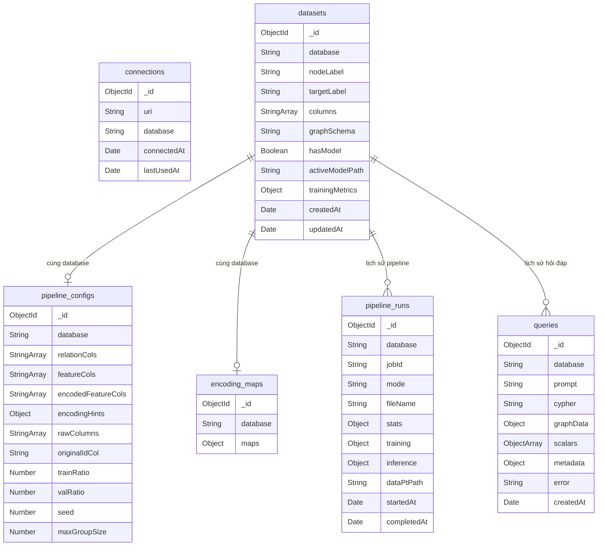

# Triển khai MongoDB trong hệ thống hiện tại

## Mục tiêu

MongoDB được dùng làm nơi lưu metadata và lịch sử thao tác của hệ thống. Neo4j vẫn là cơ sở dữ liệu đồ thị chính, còn MongoDB lưu các thông tin giúp hệ thống khôi phục trạng thái giữa các phiên làm việc, gồm:

- Thông tin kết nối Neo4j.
- Trạng thái dataset hiện tại.
- Cấu hình pipeline CSV2Graph.
- Bảng mã hóa đặc trưng dùng lại khi append.
- Lịch sử build/append CSV.
- Lịch sử hỏi đáp ngôn ngữ tự nhiên sang Cypher.

MongoDB không thay thế Neo4j. MongoDB chỉ lưu metadata, cấu hình, lịch sử và cache schema.

---

## Tổng quan các collection

Hệ thống hiện có 6 collection chính:

| Collection | Vai trò |
|---|---|
| `connections` | Lưu thông tin kết nối Neo4j đã dùng. |
| `datasets` | Lưu trạng thái dataset hiện tại theo từng database Neo4j. |
| `pipeline_configs` | Lưu cấu hình CSV2Graph và thông tin CSV gốc để append. |
| `encoding_maps` | Lưu bảng mã hóa categorical có kích thước lớn. |
| `pipeline_runs` | Lưu lịch sử các lần full build hoặc append CSV. |
| `queries` | Lưu lịch sử câu hỏi, Cypher và kết quả truy vấn. |

Sơ đồ quan hệ logic:



---

## 1. Collection `connections`

### Chức năng

Lưu thông tin kết nối Neo4j sau khi người dùng kết nối thành công. Mỗi database Neo4j có một bản ghi duy nhất.

### Thuộc tính

| Thuộc tính | Kiểu dữ liệu | Mặc định | Mô tả |
|---|---|---|---|
| `_id` | `ObjectId` | Tự sinh | Khóa chính của document MongoDB. |
| `uri` | `String` | Không có | URI kết nối Neo4j, ví dụ `bolt://localhost:7687`. |
| `database` | `String` | Không có | Tên database Neo4j. Trường này là duy nhất. |
| `connectedAt` | `Date` | Ngày hiện tại | Thời điểm kết nối lần đầu được lưu. |
| `lastUsedAt` | `Date` | Ngày hiện tại | Thời điểm kết nối được sử dụng gần nhất. |

### Ví dụ document

```json
{
  "_id": "ObjectId(...)",
  "uri": "bolt://localhost:7687",
  "database": "neo4j",
  "connectedAt": "2026-06-27T10:00:00.000Z",
  "lastUsedAt": "2026-06-27T10:15:00.000Z"
}
```

---

## 2. Collection `datasets`

### Chức năng

Lưu trạng thái dataset hiện tại của từng database Neo4j. Đây là nơi backend biết dataset đã có dữ liệu hay chưa, node chính là gì, có model GNN chưa và schema text dùng cho Text2Cypher nằm ở đâu.

Collection này thay thế một phần metadata trước đây từng lưu trong file `_latest_<database>.json` và cache schema text `schema_<database>.txt`.

### Thuộc tính

| Thuộc tính | Kiểu dữ liệu | Mặc định | Mô tả |
|---|---|---|---|
| `_id` | `ObjectId` | Tự sinh | Khóa chính của document MongoDB. |
| `database` | `String` | Không có | Tên database Neo4j. Trường này là duy nhất. |
| `nodeLabel` | `String` | Không có | Label node chính trong Neo4j, ví dụ `Transaction`. |
| `targetLabel` | `String` | Không có | Cột nhãn gian lận, ví dụ `is_fraud`. |
| `columns` | `String[]` | `[]` | Danh sách cột trên node chính sau khi xử lý/rename. |
| `graphSchema` | `String` | Không có | Schema text cache phục vụ Text2Cypher. |
| `hasModel` | `Boolean` | `false` | Cho biết dataset đã có model GNN dùng được hay chưa. |
| `activeModelPath` | `String` | Không có | Đường dẫn model đang dùng cho inference. |
| `trainingMetrics` | `Object` | Không có | Kết quả huấn luyện model, ví dụ F1, AUC, accuracy. |
| `createdAt` | `Date` | Tự sinh | Thời điểm document được tạo. |
| `updatedAt` | `Date` | Tự sinh | Thời điểm document được cập nhật gần nhất. |

`createdAt` và `updatedAt` được tạo bởi tùy chọn `timestamps: true` trong Mongoose schema.

### Ví dụ document

```json
{
  "_id": "ObjectId(...)",
  "database": "neo4j",
  "nodeLabel": "Transaction",
  "targetLabel": "is_fraud",
  "columns": ["node_id", "amt", "lat", "long", "city_pop", "is_fraud"],
  "graphSchema": "Node properties:\n- Transaction {node_id: STRING, amt: FLOAT, ...}",
  "hasModel": true,
  "activeModelPath": "L:/.../python-services/models/fgnn_star.pt",
  "trainingMetrics": {
    "val": { "f1": 0.85, "auc": 0.92 },
    "test": { "f1": 0.83, "auc": 0.9 }
  },
  "createdAt": "2026-06-27T10:00:00.000Z",
  "updatedAt": "2026-06-27T10:30:00.000Z"
}
```

---

## 3. Collection `pipeline_configs`

### Chức năng

Lưu cấu hình pipeline CSV2Graph của dataset hiện tại. Collection này giúp append CSV mới đúng schema cũ, không làm lệch model, `data.pt` hoặc encoding đã học từ lần full build.

Collection này thay thế phần cấu hình pipeline trong `_latest_<database>.json` và thông tin CSV gốc trong `_raw_<database>.json`.

### Thuộc tính

| Thuộc tính | Kiểu dữ liệu | Mặc định | Mô tả |
|---|---|---|---|
| `_id` | `ObjectId` | Tự sinh | Khóa chính của document MongoDB. |
| `database` | `String` | Không có | Tên database Neo4j. Trường này là duy nhất. |
| `relationCols` | `String[]` | `[]` | Các cột được dùng để tạo node phụ và quan hệ trong star graph. |
| `featureCols` | `String[]` | `[]` | Các cột được dùng làm đặc trưng đầu vào cho model. |
| `encodedFeatureCols` | `String[]` | `[]` | Tên các cột sau encoding, dùng để build `data.pt`. |
| `encodingHints` | `Object` | `{}` | Kiểu mã hóa cho từng cột feature do LLM gợi ý và người dùng xác nhận. |
| `rawColumns` | `String[]` | `[]` | Header CSV gốc, dùng để kiểm tra file append có thiếu cột hay không. |
| `originalIdCol` | `String` | Không có | Cột ID gốc người dùng chọn, sau đó được rename thành `node_id`. |
| `trainRatio` | `Number` | `0.4` | Tỉ lệ dữ liệu train khi build `data.pt`. |
| `valRatio` | `Number` | `0.2` | Tỉ lệ dữ liệu validation khi build `data.pt`. |
| `seed` | `Number` | `42` | Seed dùng khi chia train/validation/test. |
| `maxGroupSize` | `Number` | `500` | Giới hạn số lượng node trong mỗi nhóm quan hệ khi dựng graph. |

### Cấu trúc `encodingHints`

`encodingHints` là object có khóa là tên cột, giá trị là cấu hình encoding.

Các kiểu encoding hiện được hỗ trợ:

| Kiểu encoding | Ý nghĩa |
|---|---|
| `numeric` | Ép giá trị về số. Giá trị thiếu hoặc không hợp lệ được đưa về `0`. |
| `binary` | Mã hóa giá trị nhị phân như yes/no, true/false, 0/1. |
| `ordinal` | Mã hóa theo thứ tự do `order` quy định. |
| `cyclical` | Mã hóa chu kỳ bằng sin/cos, dùng `period`. |
| `datetime` | Tách thời gian thành hour/dow/month dạng sin/cos và year. |
| `target` | Dùng target encoding nếu có nhãn, hoặc frequency encoding nếu ingest-only. |

Ví dụ:

```json
{
  "amt": { "type": "numeric" },
  "gender": { "type": "binary" },
  "trans_date_trans_time": { "type": "datetime" },
  "month": { "type": "cyclical", "period": 12 },
  "risk_level": { "type": "ordinal", "order": ["low", "medium", "high"] },
  "merchant": { "type": "target" }
}
```

Nếu dataset cũ chưa có `encodingHints`, backend dùng mặc định `{}` và tự suy luận kiểu encoding khi cần.

### Ví dụ document

```json
{
  "_id": "ObjectId(...)",
  "database": "neo4j",
  "relationCols": ["cc_num", "merchant", "category", "job"],
  "featureCols": ["amt", "lat", "long", "city_pop", "trans_date_trans_time"],
  "encodedFeatureCols": [
    "amt",
    "lat",
    "long",
    "city_pop",
    "trans_date_trans_time_hour_sin",
    "trans_date_trans_time_hour_cos",
    "trans_date_trans_time_dow_sin",
    "trans_date_trans_time_dow_cos",
    "trans_date_trans_time_month_sin",
    "trans_date_trans_time_month_cos",
    "trans_date_trans_time_year"
  ],
  "encodingHints": {
    "amt": { "type": "numeric" },
    "trans_date_trans_time": { "type": "datetime" }
  },
  "rawColumns": ["trans_num", "trans_date_trans_time", "cc_num", "merchant", "category", "amt", "is_fraud"],
  "originalIdCol": "trans_num",
  "trainRatio": 0.4,
  "valRatio": 0.2,
  "seed": 42,
  "maxGroupSize": 500
}
```

---

## 4. Collection `encoding_maps`

### Chức năng

Lưu các bảng mapping dùng cho target encoding hoặc frequency encoding. Collection này được tách riêng vì mapping categorical có thể rất lớn. Nếu nhúng vào `datasets` hoặc `pipeline_configs`, document có thể phình to và khó quản lý.

Collection này chủ yếu được dùng khi append dữ liệu mới để đảm bảo dữ liệu append được encode giống lần full build.

### Thuộc tính

| Thuộc tính | Kiểu dữ liệu | Mặc định | Mô tả |
|---|---|---|---|
| `_id` | `ObjectId` | Tự sinh | Khóa chính của document MongoDB. |
| `database` | `String` | Không có | Tên database Neo4j. Trường này là duy nhất. |
| `maps` | `Object` | Không có | Bảng mapping theo từng cột categorical. |

### Cấu trúc `maps`

`maps` có dạng:

```json
{
  "tên_cột": {
    "giá_trị_gốc": 0.123,
    "__MISSING__": 0.05
  }
}
```

Trong đó:

- Khóa cấp 1 là tên cột cần encode.
- Khóa cấp 2 là giá trị gốc của categorical value.
- Giá trị là số đã encode.
- `__MISSING__` là giá trị fallback khi gặp dữ liệu thiếu hoặc category chưa từng xuất hiện.

### Ví dụ document

```json
{
  "_id": "ObjectId(...)",
  "database": "neo4j",
  "maps": {
    "merchant": {
      "fraud_Rippin, Kub and Mann": 0.83,
      "fraud_Heller, Gutmann and Zieme": 0.12,
      "__MISSING__": 0.05
    },
    "category": {
      "grocery_pos": 0.02,
      "shopping_net": 0.09,
      "__MISSING__": 0.05
    }
  }
}
```

---

## 5. Collection `pipeline_runs`

### Chức năng

Lưu lịch sử mỗi lần chạy pipeline CSV2Graph, bao gồm full build và append. Collection này giúp xem lại file nào đã được upload, kết quả build ra sao, có train model hay inference hay không.

### Thuộc tính

| Thuộc tính | Kiểu dữ liệu | Mặc định | Mô tả |
|---|---|---|---|
| `_id` | `ObjectId` | Tự sinh | Khóa chính của document MongoDB. |
| `database` | `String` | Không có | Database Neo4j được build hoặc append. |
| `jobId` | `String` | Không có | Mã định danh của lần chạy pipeline. |
| `mode` | `String` | Không có | Chế độ chạy. Chỉ nhận `full` hoặc `append`. |
| `fileName` | `String` | Không có | Tên file CSV người dùng upload. |
| `stats` | `Object` | Không có | Thống kê kết quả build, ví dụ số node, edge, feature. |
| `training` | `Object` hoặc `null` | Không có | Kết quả train GNN nếu có. |
| `inference` | `Object` hoặc `null` | Không có | Kết quả inference khi append nếu có model. |
| `dataPtPath` | `String` | Không có | Đường dẫn file `data.pt`. |
| `startedAt` | `Date` | Ngày hiện tại | Thời điểm bắt đầu ghi nhận pipeline run. |
| `completedAt` | `Date` | Không có | Thời điểm pipeline hoàn tất. |

Collection này có index:

```ts
{ database: 1, startedAt: -1 }
```

Index này giúp lấy lịch sử chạy pipeline theo database và sắp xếp lần mới nhất trước.

### Ví dụ document

```json
{
  "_id": "ObjectId(...)",
  "database": "neo4j",
  "jobId": "2026-06-27T15-08-31-222Z_fraudTrain_200_300_eeaec01d",
  "mode": "full",
  "fileName": "fraudTrain_200_300.csv",
  "stats": {
    "numNodes": 101,
    "numEdges": 218,
    "numFeatures": 16
  },
  "training": {
    "success": true,
    "epochsRun": 31,
    "bestMetric": 1.0
  },
  "inference": null,
  "dataPtPath": "backend-kltn/data/csv2graph/.../data.pt",
  "startedAt": "2026-06-27T15:08:31.222Z",
  "completedAt": "2026-06-27T15:12:00.000Z"
}
```

---

## 6. Collection `queries`

### Chức năng

Lưu lịch sử hỏi đáp giữa người dùng và hệ thống Text2Cypher. Mỗi câu hỏi có thể lưu prompt, Cypher sinh ra, kết quả graph, kết quả bảng, metadata debug hoặc lỗi nếu truy vấn thất bại.

Collection này giúp lịch sử truy vấn nằm ở server thay vì chỉ nằm trong trình duyệt.

### Thuộc tính

| Thuộc tính | Kiểu dữ liệu | Mặc định | Mô tả |
|---|---|---|---|
| `_id` | `ObjectId` | Tự sinh | Khóa chính của document MongoDB. |
| `database` | `String` | Không có | Database Neo4j được truy vấn. |
| `prompt` | `String` | Không có | Câu hỏi ngôn ngữ tự nhiên của người dùng. |
| `cypher` | `String` | Không có | Cypher cuối cùng được sinh ra hoặc được thực thi. |
| `graphData` | `Object` | Không có | Kết quả dạng graph, thường gồm `nodes` và `links`. |
| `scalars` | `Object[]` | Không có | Kết quả dạng bảng/scalar. |
| `metadata` | `Object` | Không có | Metadata debug, ví dụ retry, cypherV1, cypherV2, linked schema. |
| `error` | `String` | Không có | Thông báo lỗi nếu query thất bại. |
| `createdAt` | `Date` | Ngày hiện tại | Thời điểm lưu query. |

Collection này có index:

```ts
{ database: 1, createdAt: -1 }
```

Index này giúp lấy lịch sử câu hỏi theo database và sắp xếp câu hỏi mới nhất trước.

### Ví dụ document

```json
{
  "_id": "ObjectId(...)",
  "database": "neo4j",
  "prompt": "Show fraud transactions that share the same merchant with other transactions",
  "cypher": "MATCH (fraud:Transaction)-[fm1:HAS_MERCHANT]->(merchant:MerchantNode)<-[fm2:HAS_MERCHANT]-(other:Transaction) WHERE toString(fraud.is_fraud) = \"1\" RETURN fraud, merchant, other, fm1, fm2 LIMIT 50",
  "graphData": {
    "nodes": [],
    "links": []
  },
  "scalars": [],
  "metadata": {
    "retries": 0,
    "cypherV1": "...",
    "cypherV2": "..."
  },
  "error": null,
  "createdAt": "2026-06-27T10:30:00.000Z"
}
```

---

## Cách backend đọc và ghi MongoDB

### Khi kết nối Neo4j

Sau khi kết nối Neo4j thành công, backend lưu hoặc cập nhật document trong `connections`.

Luồng chính:

1. Người dùng nhập URI, username, password, database.
2. Backend kiểm tra kết nối Neo4j.
3. Nếu thành công, backend gọi `ConnectionService.upsert()`.
4. Collection `connections` được cập nhật theo `database`.

---

### Khi full build CSV

Khi database chưa có dataset và người dùng upload CSV, backend thực hiện full build.

MongoDB được ghi vào các collection:

| Collection | Dữ liệu được ghi |
|---|---|
| `datasets` | `nodeLabel`, `targetLabel`, `columns`, thông tin model nếu có. |
| `pipeline_configs` | `relationCols`, `featureCols`, `encodedFeatureCols`, `encodingHints`, `rawColumns`, `originalIdCol`, split ratio. |
| `encoding_maps` | Mapping encode categorical nếu có. |
| `pipeline_runs` | Lịch sử lần full build, thống kê, training, dataPtPath. |

Nếu có train model, `datasets.hasModel`, `datasets.activeModelPath` và `datasets.trainingMetrics` cũng được cập nhật.

---

### Khi append CSV

Khi database đã có dataset, upload CSV mới sẽ chạy append.

Backend đọc:

- `datasets` để biết dataset hiện tại và model đang dùng.
- `pipeline_configs.rawColumns` để kiểm tra file append có đủ cột gốc hay không.
- `pipeline_configs.encodingHints` để encode theo schema cũ.
- `encoding_maps.maps` để encode categorical giống lần full build.

Quy tắc append hiện tại:

- Thiếu cột gốc thì báo lỗi.
- Cột dư trong file append bị bỏ qua.
- Không cho đổi schema hoặc encoding khi append.
- Nếu có model và file append thiếu target label, backend build `data.pt` inference để dự đoán nhãn gian lận.

Sau append, backend ghi thêm một document vào `pipeline_runs`.

---

### Khi Text2Cypher cần schema

`datasets.graphSchema` là cache schema text dùng cho Text2Cypher.

Luồng chính:

1. Backend kiểm tra schema trong MongoDB.
2. Nếu đã có `datasets.graphSchema`, Text2Cypher dùng cache này.
3. Nếu cần cập nhật schema, backend introspect Neo4j rồi gọi `DatasetService.updateGraphSchema()`.

---

### Khi người dùng hỏi bằng ngôn ngữ tự nhiên

Sau khi user gửi câu hỏi, backend lưu lịch sử vào `queries`.

Trường hợp thành công:

- Lưu `prompt`.
- Lưu `cypher`.
- Lưu `graphData`.
- Lưu `scalars`.
- Lưu `metadata`.

Trường hợp thất bại:

- Lưu `prompt`.
- Lưu `error`.
- Có thể lưu thêm metadata nếu có.

---

## Mapping từ file cũ sang MongoDB

| Cách lưu cũ | Collection hiện tại | Ghi chú |
|---|---|---|
| `schema_<database>.txt` | `datasets.graphSchema` | Cache schema text cho Text2Cypher. |
| `_latest_<database>.json` | `datasets` | Trạng thái dataset và model. |
| `_latest_<database>.json.schema` | `pipeline_configs` | Cấu hình relation, feature, encoding và split. |
| `_latest_<database>.json.encoding_maps` | `encoding_maps` | Tách riêng vì mapping có thể rất lớn. |
| `_raw_<database>.json` | `pipeline_configs.rawColumns`, `pipeline_configs.originalIdCol` | Dùng validate append. |
| `localStorage` kết nối Neo4j | `connections` | Lưu thông tin kết nối phía server. |
| `localStorage` lịch sử query | `queries` | Lưu lịch sử hỏi đáp phía server. |
| Không có tương ứng cũ | `pipeline_runs` | Lưu lịch sử full build và append. |

---

## Ghi chú quan trọng

- `database` là khóa logic quan trọng nhất trong hầu hết collection. Nó giúp metadata MongoDB gắn đúng với database Neo4j đang dùng.
- `datasets` không lưu toàn bộ cấu hình pipeline. Cấu hình chi tiết nằm ở `pipeline_configs`.
- `encoding_maps` chỉ lưu mapping encode lớn, không lưu mọi loại encoding. Kiểu encoding nằm ở `pipeline_configs.encodingHints`.
- `pipeline_runs.jobId` chỉ là lịch sử từng lần chạy, không phải nguồn sự thật chính của dataset hiện tại.
- Dataset hiện tại được backend reconstruct từ `datasets`, `pipeline_configs` và `encoding_maps`.
- Dataset cũ không có `encodingHints` vẫn chạy được vì mặc định là `{}`.
- MongoDB lưu metadata và lịch sử; dữ liệu graph thật vẫn nằm trong Neo4j.
